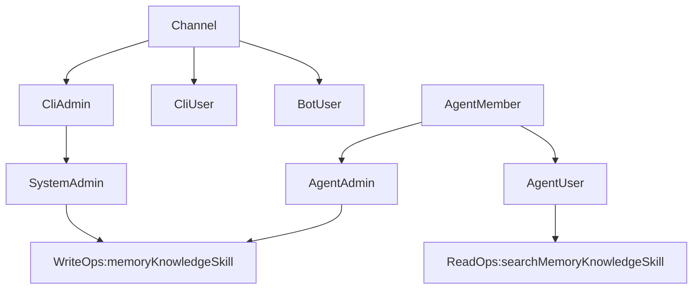

# Agent 权限梳理与建议

## 目标口径
你的目标可以收敛成 5 条：
- 接入方式与权限解耦：`CLI` 只是一个 `channel`，不是权限本身。
- `CLI` 下也区分 `admin` 与 `user`：其中 `CLI admin` 才是系统管理员，`CLI user` 只有普通权限。
- `CLI` 不直接读取数据库，只能作为 `channel=cli` 与 `server` 交互；所有权限判断和数据读写统一在 `server` 完成。
- `CLI admin` 默认进入系统管理视角，并支持 agent 切换；`/agent switch|list|create|...` 只允许在 CLI 使用。
- 每个 agent 维护独立成员表，成员角色只有 `admin` 和 `user`，且支持多管理员、多普通用户。
- agent 内只有 `admin` 才能写当前 agent 的 `memory / knowledge / skill`；普通用户只能查询和使用，不能新增、修改、删除。
- 只有 `CLI admin` 拥有全局 `memory / knowledge / skill` 的写权限；非 CLI channel 默认不授予系统管理员能力。

## 当前实现情况

### 1. RBAC 基础模型基本已具备
- 用户全局角色在 `src/auth/rbac.ts` 中定义，只有 `admin | user` 两类；`isSystemAdmin()` 当前等价于 `isAdmin()`。
- agent 成员关系在 `src/db/schema.ts` 的 `agent_members` 表中定义，角色也是 `admin | user`。
- `isAgentAdmin(agentId)` 已实现“系统管理员直接通过，否则检查 `agent_members` 是否为 admin”。
- `src/llm/agents/config.ts` 已支持 `toolsMode / userToolsMode`，并在 `getAgentTools()` 中对 agent admin 与普通成员返回不同工具集。

### 2. Agent CRUD 与成员管理已部分符合目标
- `src/llm/agents/config.ts` 中：
- `saveAgent()`：新建 agent 需要 `isSystemAdmin()`，更新已有 agent 需要 `isAgentAdmin(existing.id)`。
- `manageAgentMember()` / `listAgentMembers()`：需要系统管理员或该 agent 管理员。
- schema seed 已初始化默认 agent 与默认成员，见 `src/db/schema.ts`。

这说明“单个 agent 支持多 admin、多 user”这部分底座已经具备。

### 3. memory / knowledge / skill 的写权限大体方向正确
- `memory`：`src/tools/memory-tools.ts` 和 `src/commands/memory-cmd.ts` 都实现了：
- `global` scope 仅系统管理员可写。
- `agent` scope 仅系统管理员或对应 agent admin 可写。
- `knowledge`：`src/tools/knowledge-tools.ts` 中新增/更新/删除要求当前 agent admin，且更新/删除还会校验知识条目是否属于当前 agent。
- `skill`：`src/commands/skill.ts` 中 `saveSkill()` / `deleteSkill()` 已实现：全局 skill 仅系统管理员可写，agent skill 仅系统管理员或对应 agent admin 可写。

这部分已经非常接近你的第 3、4 条目标。

## 关键偏差

### 1. “系统管理员 = CLI” 目前并不存在
- `src/index.ts` 的 `login()` 只是优先登录用户名为 `admin` 的系统用户，并没有“当前入口是 CLI”这一层身份概念。
- `src/auth/rbac.ts` 的 `isSystemAdmin()` 纯粹等价于 `user.role === 'admin'`，没有叠加 `channel === 'cli'` 条件。
- 结果是：只要某个入口把用户构造成 `role: 'admin'`，它就自动获得全局管理员能力，无法表达“CLI admin 才是系统管理员，CLI user 只是普通用户”。

### 1.1 当前实现仍是 CLI 直连 DB，本质上不是 channel 架构
- 当前 CLI 在 `src/index.ts` 启动后直接初始化 schema、直接读取用户、直接调用本地命令函数。
- 这意味着它更像“本地管理进程”，而不是“通过 server 接入的一个 channel”。
- 如果你的目标是“CLI 只是接入方式，不能直接读 DB”，那后续架构应改为：CLI 只负责交互与展示，所有数据访问和权限校验都经由 server API / RPC 完成。

### 2. Feishu admin 当前被提升成了全局系统管理员
- `src/feishu/bot.ts` 的 `getSessionForInstance()` 中，命中的飞书管理员会被直接构造成 `{ id: 'admin-001', role: 'admin' }`。
- 这会让飞书管理员天然拥有 `isSystemAdmin()`，从而获得全局 `memory / knowledge / skill / assignment / agent create` 等能力。
- 这与“agent 管理员只对当前 agent 有写权限”明显不一致。

### 3. `/agent` 相关操作并没有限制在 CLI
- CLI 命令注册在 `src/commands/router.ts`，但同名能力也暴露给了 tool 和 bot。
- `src/tools/agent-tools.ts` 暴露了 `list_agents / get_agent / save_agent / delete_agent / switch_agent / assign_agent / unassign_agent`。
- `src/feishu/bot.ts` 和 `src/wework/bot.ts` 也支持 `/agent list` 和 `/agent <name>` 切换。
- 所以当前并不满足“`/agent switch|list|create` 仅支持 CLI”。

### 4. 三套入口的权限判断不一致
- CLI：主要走 command 层权限。
- Tool：主要走 `tool handler` + `isAgentAdmin()`。
- Feishu slash command：有一部分直接绕过 tool handler，自己判断 `isAdminFeishuUser()`。
- 最明显的例子是 `src/feishu/bot.ts` 的 `handleMemoryCommand()`：
- `/memory add` 只看 `isAdminFeishuUser()`，然后直接调用 `saveMemory()`。
- `/memory del` 也只看 `isAdminFeishuUser()`，然后直接调用 `deleteMemory()`。
- 但底层 `src/llm/agents/memory.ts` 本身没有权限校验，真正的 RBAC 在 `memory-tools.ts` / `memory-cmd.ts`。
- 结果是 Feishu memory 权限与 CLI/tool 并不一致。

### 5. prompt 文案与真实权限不一致
- `src/llm/agents/prompt.ts` 目前按 `user.role === 'user'` 直接告诉模型“普通用户不可执行写操作”。
- 但真实代码里，`role = user` 的用户仍然可能通过 `agent_members.role = admin` 获得某个 agent 的写权限。
- 这会误导模型，尤其是在 agent admin 不是系统 admin 的场景下。

### 6. CLI 下 skill 的全局/当前 agent 语义还不够统一
- `src/commands/skill.ts` 里 `skill save` 默认走全局 `saveSkill(name, prompt)`，没有显式按当前 agent 保存。
- 但 `skill del` 默认按 `getCurrentAgent()?.id` 删除。
- 这和“CLI admin 有全局权限，同时 agent admin 仅限当前 agent 写权限”的产品心智不完全一致，后续需要明确命令语义。

## 建议方案

### 建议 1. 明确分成两层权限，而不是继续混用
建议在语义上固定三层：
- `channel`：`cli | feishu | telegram | wework | ...`，只表示接入方式。
- `system_role`：`admin | user`，只表示是否有全局权限。
- `agent_membership_role`：`admin | user`，只表示某个 agent 内的权限。

对应关系建议固定为：
- `CLI admin` = `channel=cli` 且 `system_role=admin`，拥有全局 `memory / knowledge / skill / agent assignment / agent create` 权限。
- `CLI user` = `channel=cli` 且 `system_role=user`，无全局权限，只能依赖 agent membership 获得 agent 内权限。
- `bot user` 默认不是系统管理员，只通过 `agent_members` 获得 `agent_admin / agent_user` 能力。

不一定要立刻改数据库字段名，但代码里至少要把“系统管理员能力”与“CLI admin 会话”绑定起来，并且该会话应由 server 统一签发/识别，而不是 CLI 直接读库后自行判定。

### 建议 2. 引入 `executionContext/channel` 作为权限判断输入
优先在 server 侧的鉴权/RBAC 层引入 `executionContext/channel`，例如 `channel = cli | feishu | telegram | wework`，CLI 通过 API/RPC 显式传入该上下文。

推荐规则：
- `isSystemAdmin()` 不再只看 `user.role`，而是同时要求当前上下文为 `cli` 且当前会话用户是 `system_role=admin`。
- `CLI user` 虽然也属于 `cli` channel，但不具备系统管理员能力。
- bot 侧即使用户是某个 agent 的管理员，也不应天然拥有全局系统管理员能力。
- CLI 登录时应由 server 返回当前用户的 `system_role` 与可访问 agent，而不是把 CLI 本地登录等同于权限判定。

这是最关键的一步，解决后第 1 条和第 4 条才真正成立。

### 建议 3. `/agent` 管理能力只保留在 CLI
建议把下面能力从 bot 和 native tool 中下沉为 CLI-only：
- `list_agents`
- `switch_agent`
- `save_agent`
- `delete_agent`
- `assign_agent`
- `unassign_agent`
- `list_agent_assignments`

落地方向：
- CLI 保留 `src/commands/agent.ts` 作为唯一入口。
- 从 `src/tools/agent-tools.ts` 中移除这些管理工具，或者在 handler 内显式限制 `channel === 'cli'`。
- 从 `src/feishu/bot.ts` 与 `src/wework/bot.ts` 中移除 `/agent list` 和 `/agent <name>` 切换能力。

如果你还希望 bot 能“知道当前绑定的是哪个 agent”，可以只保留只读的 `/agent` 查看当前 agent，不保留 list/switch/create。

### 建议 4. 所有写权限统一收口到命令函数/核心 service
当前最大风险不是逻辑没有，而是“不同入口绕开不同校验”。

建议统一原则：
- 真正的权限校验不要只放在 tool handler 或 bot command handler。
- `memory / knowledge / skill / agent` 的核心写函数本身就应该只存在于 server 侧，接收 `actor + currentAgent + channel` 并完成最终权限判断。
- CLI、tool、Feishu 都只做 server 的薄客户端或 server 内部适配层。

优先收口的几个点：
- `src/llm/agents/memory.ts`：把写权限前置到这里，而不是只依赖 `memory-tools.ts` / `memory-cmd.ts`。
- `src/commands/knowledge.ts`：`addKnowledge / updateKnowledgeById / deleteKnowledge` 建议内建权限判断，不要只靠 `knowledge-tools.ts`。
- `src/commands/skill.ts`：这块已经较好，可以作为统一模式参考。

### 建议 5. Feishu/Telegram/WeWork 只保留 agent 内权限，不授予全局权限
建议 bot 侧用户映射改成：
- bot 用户始终落库为真实 user id，例如 `feishu_xxx`。
- 是否拥有某个 agent 的写权限，只通过 `agent_members` 判断。
- 不要再把 Feishu admin 映射成 `admin-001` 或任何 `CLI admin` 身份。

这样能自然满足：
- 同一个人可以是多个 agent 的 admin。
- 也可以只是某一个 agent 的普通用户。
- bot 侧无法越权写全局 memory/knowledge/skill。

### 建议 6. system prompt 改为描述“当前 agent 权限”
建议修改 `src/llm/agents/prompt.ts` 的文案来源，不要只看 `user.role`，而是注入：
- 当前是否为 CLI 系统管理员。
- 当前是否为该 agent 的管理员。
- 当前允许写哪些资源，禁止写哪些资源。

这样模型的行为才能与代码一致，减少无效 tool 调用。

## 建议的落地顺序
1. 先统一架构边界：明确 CLI 不再直连 DB，而是只调用 server 接口。
2. 再统一权限模型：在 server 侧引入 `channel/executionContext`，把 `CLI admin`、`CLI user`、`agent 管理员` 区分开。
3. 然后收口核心写权限：memory、knowledge、skill 的写操作统一下沉到 server 核心服务层。
4. 再裁剪入口：移除 bot/tool 中越权的 `/agent list|switch|create|assign` 管理能力，只保留 server 认可的 CLI channel 接口。
5. 最后修正文案与工具暴露：更新 prompt、tool 暴露面、以及 CLI 的交互语义。

## 结论
当前代码并不是从零开始，底层已经有较完整的：
- `users.role` 全局角色
- `agent_members` 成员角色
- `isAgentAdmin()`
- `userToolsMode` 与普通成员工具裁剪
- agent 级 memory/knowledge/skill 写权限

真正的问题主要有 3 个：
- `CLI` 当前仍是直连 DB 的本地管理进程，不符合“channel 只能经由 server 访问”的边界。
- “系统管理员”没有和 `CLI admin` 会话绑定，当前也无法表达 `CLI user`。
- bot/tool/CLI 三套入口权限判断不一致。
- `/agent` 管理能力泄露到了 bot 与 tool。

如果按上面的顺序调整，现有结构足够支撑你的目标，不需要大改表结构，重点是收紧入口和统一权限判断位置。
