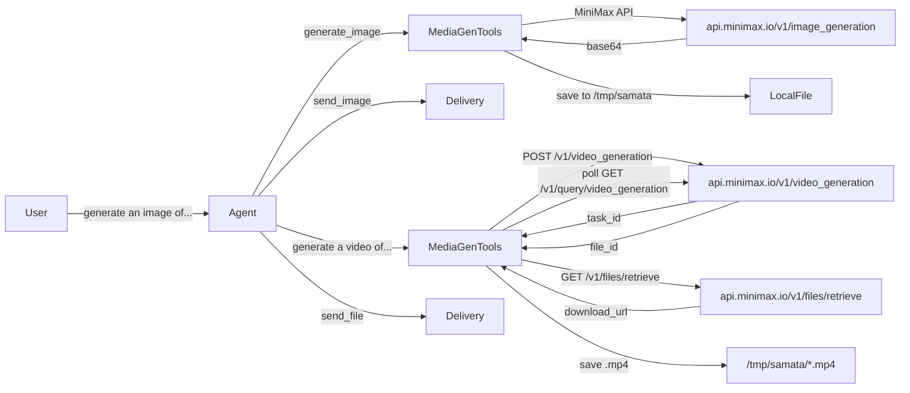

# Add Text-to-Image and Text-to-Video Generation

## Background

The project already has `MINIMAX_API_KEY` configured in `.env` and a MiniMax LLM provider. MiniMax offers both image generation (`image-01` model via `POST /v1/image_generation`) and video generation (`MiniMax-Hailuo-2.3` model via `POST /v1/video_generation` + async polling). openclaw has a well-architected image generation system via plugins, but text-to-video is not implemented there. We will build a simpler, self-contained implementation suited to Samata's architecture.

## Architecture Decision

**Native tools** (not MCP): Add a new tool module `src/tools/media-gen-tools.ts` with two tools: `generate_image` and `generate_video`. Core API logic lives in `src/commands/media-gen.ts` (following the project's command-reuse convention). Both tools save output to `/tmp/samata/` and return the file path so the agent can use `send_image`/`send_file` to deliver results.

## Files to Create/Modify

### New Files

1. **`src/commands/media-gen.ts`** - Core API logic
   - `generateImage(prompt, options?)` - Calls MiniMax `POST /v1/image_generation`
     - Parameters: `prompt`, `aspectRatio?` (default "1:1"), `count?` (1-9, default 1)
     - Model: `image-01`
     - Returns base64 images, decodes and saves as PNG to `/tmp/samata/`
   - `generateVideo(prompt, options?)` - Calls MiniMax `POST /v1/video_generation` (async)
     - Parameters: `prompt`, `duration?` (6 or 10, default 6), `resolution?` ("768P"/"1080P", default "768P")
     - Model: `MiniMax-Hailuo-2.3`
     - Flow: submit task -> poll `GET /v1/query/video_generation` every 5s (max ~5 min) -> get `file_id` -> `GET /v1/files/retrieve` -> download video -> save as `.mp4`
   - Uses `MINIMAX_API_KEY` and `MINIMAX_BASE_URL` from env (already configured)

2. **`src/tools/media-gen-tools.ts`** - Tool definitions + handlers
   - `generate_image` tool: prompt (required), aspect_ratio (optional), count (optional)
   - `generate_video` tool: prompt (required), duration (optional), resolution (optional)
   - Thin wrappers calling `src/commands/media-gen.ts`

### Modified Files

3. **`src/tools/index.ts`** - Register `mediaGenTools` in the modules array

4. **`src/llm/tool-types.ts`** - Add input types:
   - `GenerateImageInput = { prompt: string; aspect_ratio?: string; count?: number }`
   - `GenerateVideoInput = { prompt: string; duration?: number; resolution?: string }`

5. **`src/llm/agents/config.ts`** - Add `generate_image` and `generate_video` to `common` and `alter_ego` presets in `TOOL_PRESETS`

6. **`src/llm/agent.ts`** - Update system prompt to mention image/video generation capabilities

## Key Design Choices

- **MiniMax only** for now - the user already has `MINIMAX_API_KEY` configured; no new dependencies or API keys needed
- **Video generation is async** (takes 30-120s typically) - the tool will poll and block until done or timeout, returning status updates via the tool result. The agent loop handles this naturally since tool execution is awaited.
- **No new npm dependencies** - uses built-in `fetch` (via undici) for HTTP calls
- **Reuse existing delivery** - generated files saved to `/tmp/samata/`, then `send_image` / `send_file` tools handle delivery to any channel (feishu, telegram, CLI)
