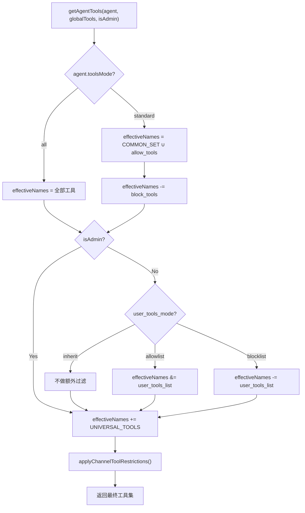

# Agent 工具权限矩阵重构

## 设计目标

建立清晰的 **agent + user 两层权限管理机制**：

- **Agent 层**：决定该 agent 的能力边界 = `COMMON_SET ∪ allow_tools \ block_tools`
- **User 层**：每个 agent 通过 `user_tools_mode` / `user_tools_list` 独立配置非 admin 用户的工具范围
- **Channel 层**：CLI-only 工具在 bot channel 中过滤（保持不变）

## 现状与改动对照

### 现有机制（[config.ts](../../src/llm/agents/config.ts)）

```
Agent 有效工具 = TOOL_PRESETS[preset].tools ∪ tools_list  (allowlist 模式)
User  有效工具 = user_tools_mode 决定（inherit → readonly preset）
```

问题：preset 概念与 tools_list 累积式迁移交织，难以审计和维护。

### 新机制

```
Agent 有效工具 = (COMMON_SET ∪ allow_tools) \ block_tools    (standard 模式)
                 或 全量工具                                   (all 模式)
User  有效工具 = user_tools_mode / user_tools_list 独立控制    (每个 agent 各自配置)
```

---

## 第一层：COMMON_SET（含读写，25 个工具）

作为绝大部分 agent 的基础能力集。在 [config.ts](../../src/llm/agents/config.ts) 中定义：

```typescript
export const COMMON_SET = new Set([
  // Knowledge（读写）
  'search_knowledge', 'add_knowledge', 'update_knowledge', 'delete_knowledge',
  // Skill（全套）
  'list_skills', 'get_skill', 'save_skill', 'delete_skill', 'run_skill',
  // System（状态查看）
  'get_status_summary',
  // Memory（全套）
  'save_memory', 'search_memory', 'delete_memory',
  // Delivery（发送，不含文件读写）
  'write_artifact', 'send_file', 'send_image',
  // Reminder
  'set_reminder', 'list_reminders', 'cancel_reminder',
  // Todo
  'create_todo', 'list_todos', 'update_todo', 'delete_todo',
  // Media
  'generate_image', 'generate_video',
]);
```

以下工具不在 COMMON_SET 中，需要通过 `allow_tools` 显式添加：

- **文件读写**: `read_file`, `write_file`, `edit_file`, `list_directory`, `exec_cmd`, `reload_app`
- **Agent 管理**: `list_agents`, `get_agent`, `save_agent`, `delete_agent`, `switch_agent`, `assign_agent`, `unassign_agent`, `list_agent_assignments`, `manage_agent_member`, `list_agent_members`
- **领域专属**: client/trade/health/wework/markdown 等模块工具

---

## 第二层：Agent 配置矩阵

`tools_mode` 取值：

- `'all'` — 拥有全部 70+ 工具（保留用于特殊场景，目前无 agent 使用）
- `'standard'` — 使用 `COMMON_SET ∪ allow_tools \ block_tools` 计算（所有 agent 统一使用）

### 不在 COMMON_SET 中的工具速查

以下工具必须通过 `allow_tools` 显式添加才可用（按模块分组）：

- **File (6)**: `read_file`, `write_file`, `edit_file`, `list_directory`, `exec_cmd`, `reload_app`
- **Agent 管理 (10)**: `list_agents`, `get_agent`, `save_agent`, `delete_agent`, `switch_agent`, `assign_agent`, `unassign_agent`, `list_agent_assignments`, `manage_agent_member`, `list_agent_members`
- **Client (8)**: `query_clients`, `view_client`, `get_client_history`, `add_client`, `update_client`, `advance_client`, `rollback_client`, `delete_client`
- **Trade (4)**: `query_trades`, `trade_summary`, `plot_trades`, `list_customers`
- **Knowledge 扩展 (3)**: `assign_knowledge_agent`, `unassign_knowledge_agent`, `get_knowledge_agents`
- **Memory 扩展 (1)**: `update_memory`
- **WeWork (1)**: `extract_wework_qa`
- **Markdown (1)**: `markdown_to_image`
- **Health (10)**: `add_health_record`, `query_health_records`, `health_summary`, `archive_health_file`, `list_health_files`, `view_health_file`, `log_sleep`, `log_meal`, `log_symptom`, `set_medication_reminder`
- **System 扩展 (1)**: `list_tool_presets`
- **UNIVERSAL**: `http_request`（自动注入，无需配置）

### 8 个 Agent 配置矩阵

> allow_tools 仅列出 COMMON_SET 之外的增量工具，不与 COMMON_SET 重复。
> agent 有效工具 = COMMON_SET (25) + allow_tools - block_tools + http_request (universal)

| Agent | 模式 | allow | block | 有效工具数 |
|-------|------|-------|-------|-----------|
| **otcclaw** (工作助理) | standard | Client(8) + Trade(4) + Knowledge扩展(3) + `extract_wework_qa`, `markdown_to_image`, `update_memory` = 18 | 无 | **44** |
| **alter-ego** (我的助理) | standard | File(6) + Agent管理(10) + Knowledge扩展(3) + `extract_wework_qa`, `markdown_to_image`, `update_memory` = 22 | 无 | **48** |
| **tutor** (家庭教师) | standard | 无 | 无 | **26** |
| **falcon** (消息监控) | standard | 无 | `generate_image`, `generate_video`, `save_skill` = 3 | **23** |
| **potato** (丁丁助理) | standard | 无 | 无 | **26** |
| **doctor** (家庭医生) | standard | Health(10) + `update_memory` = 11 | 无 | **37** |
| **man** (黄老师助理) | standard | 无 | 无 | **26** |
| **admin** (系统管理员) | — | 通过 CLI 使用 otcclaw | — | 同 otcclaw |

---

## 第三层：User 权限（每 agent 独立配置）

保留现有 DB 字段 `user_tools_mode` + `user_tools_list`，改造 `getAgentTools()` 中非 admin 用户的逻辑：

- `'inherit'`（默认）：user 获得与 admin 相同的 agent 有效工具集（即不限制）
- `'allowlist'`：user 只能使用 `user_tools_list` 中的工具
- `'blocklist'`：user 在 agent 有效集上排除 `user_tools_list` 中的工具

**建议的 user 默认配置**（对于需要限制的 agent）：

- **otcclaw**: `user_tools_mode='blocklist'`, `user_tools_list` = 增删改类工具（exec_cmd, reload_app, delete_client 等）
- **tutor / potato / man / falcon**: `user_tools_mode='inherit'`（家庭场景，用户即管理员）
- **doctor**: `user_tools_mode='inherit'`（用户需要记录健康数据）
- **alter-ego**: `user_tools_mode='inherit'`（个人助理，信任用户）

---

## 实施方案

### 1. DB Schema 变更（[schema.ts](../../src/db/schema.ts)）

- 新增 `block_tools TEXT` 列
- 重建 agents 表以更新 CHECK 约束支持 `'standard'`
- 不重命名 `tools_list`（保持兼容），代码中映射为 allow_tools

### 2. AgentConfig 接口改造（[config.ts](../../src/llm/agents/config.ts)）

```typescript
export interface AgentConfig {
  // ...existing fields...
  toolsMode: 'all' | 'standard';    // 废弃 'allowlist' | 'blocklist'（保留向后兼容）
  toolsList: string[];               // 保留字段名，语义变为 allow_tools
  blockTools: string[];              // 新增
  preset?: string;                   // 保留但不再参与计算
  userToolsMode: 'inherit' | 'allowlist' | 'blocklist';
  userToolsList: string[];
}
```

### 3. getAgentTools() 三层计算逻辑

```typescript
export function getAgentTools(agent: AgentConfig, globalTools: Anthropic.Tool[], isAdmin = true): Anthropic.Tool[] {
  // Layer 1: Agent effective set
  let effectiveNames: Set<string>;
  if (agent.toolsMode === 'all') {
    effectiveNames = new Set(globalTools.map(t => t.name));
  } else if (agent.toolsMode === 'standard') {
    effectiveNames = new Set([...COMMON_SET, ...agent.toolsList]);
    for (const b of agent.blockTools) effectiveNames.delete(b);
  } else { /* legacy allowlist/blocklist backward compat */ }

  // Layer 2: User filtering (non-admin only)
  if (!isAdmin) {
    if (uMode === 'allowlist') effectiveNames ∩= userToolsList;
    else if (uMode === 'blocklist') effectiveNames -= userToolsList;
    // inherit: no extra filtering
  }

  // Layer 3: UNIVERSAL_TOOLS + channel restrictions
  for (const u of UNIVERSAL_TOOLS) effectiveNames.add(u);
  return applyChannelToolRestrictions(globalTools.filter(t => effectiveNames.has(t.name)));
}
```

### 4. 数据迁移

- 所有现有 agent 从 `allowlist`/`all` 模式迁移到 `standard`
- `tools_list` 清理为仅包含 COMMON_SET 之外的增量工具
- 每个 agent 按矩阵设置正确的 allow/block

### 5. 新增 3 个 agent seed

- **falcon**: standard, block = [generate_image, generate_video, save_skill]
- **potato**: standard, 纯 COMMON_SET
- **man**: standard, 纯 COMMON_SET

---

## 权限计算流程图



---

## 改动文件清单

- [src/llm/agents/config.ts](../../src/llm/agents/config.ts) — 核心：COMMON_SET、AgentConfig、getAgentTools()、saveAgent()
- [src/db/schema.ts](../../src/db/schema.ts) — block_tools 列、CHECK 约束更新、数据迁移、新 agent seed
- [src/tools/agent-tools.ts](../../src/tools/agent-tools.ts) — save_agent tool 新增 blockTools 参数
- [src/tools/system-tools.ts](../../src/tools/system-tools.ts) — list_tool_presets 返回 COMMON_SET 信息
- [src/commands/agent.ts](../../src/commands/agent.ts) — CLI 创建向导适配 standard 模式
