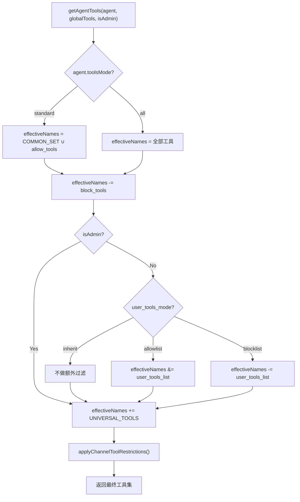

---
docModules:
  - permissions
  - plugins
docTopics:
  permissions: 工具可见性
  plugins: Agent 绑定
canonicalDocs:
  - /permissions/tool-access
  - /plugins/bind-to-agent
status: implemented
---

# Agent 工具权限矩阵重构

## 设计目标

建立清晰的 **agent + user 两层权限管理机制**：

- **Agent 层**：决定该 agent 的能力边界 = `COMMON_SET ∪ allow_tools \ block_tools`
- **User 层**：每个 agent 通过 `user_tools_mode` / `user_tools_list` 独立配置非 admin 用户的工具范围
- **Channel 层**：CLI-only 工具在 bot channel 中过滤（保持不变）

## 现状与改动对照

### 现有机制（[config.ts](../../src/llm/agents/config.ts)）

```
Agent 有效工具 = TOOL_PRESETS[preset].tools ∪ tools_list  (allowlist 模式)
User  有效工具 = user_tools_mode 决定（inherit → readonly preset）
```

问题：preset 概念与 tools_list 累积式迁移交织，难以审计和维护。

### 新机制

```
Agent 有效工具 = (COMMON_SET ∪ allow_tools) \ block_tools    (standard 模式)
                 或 全量 \ block_tools                         (all 模式，如 admin)
User  有效工具 = user_tools_mode / user_tools_list 独立控制    (每个 agent 各自配置)
```

---

## 第一层：COMMON_SET（含读写，25 个工具）

作为绝大部分 agent 的基础能力集。在 [config.ts](../../src/llm/agents/config.ts) 中定义：

```typescript
export const COMMON_SET = new Set([
  // Knowledge（读写）
  'search_knowledge', 'add_knowledge', 'update_knowledge', 'delete_knowledge',
  // Skill（全套）
  'list_skills', 'get_skill', 'save_skill', 'delete_skill', 'run_skill',
  // System（状态查看）
  'get_status_summary',
  // Memory（全套）
  'save_memory', 'search_memory', 'delete_memory',
  // Delivery（发送，不含文件读写）
  'write_artifact', 'send_file', 'send_image',
  // Reminder
  'set_reminder', 'list_reminders', 'cancel_reminder',
  // Todo
  'create_todo', 'list_todos', 'update_todo', 'delete_todo',
  // Media
  'generate_image', 'generate_video',
]);
```

以下工具不在 COMMON_SET 中，需要通过 `allow_tools` 显式添加：

- **文件读写**: `read_file`, `write_file`, `edit_file`, `list_directory`, `exec_cmd`, `reload_app`
- **Agent 管理**: `list_agents`, `get_agent`, `save_agent`, `delete_agent`, `switch_agent`, `assign_agent`, `unassign_agent`, `list_agent_assignments`, `manage_agent_member`, `list_agent_members`
- **领域专属**: client/trade/wework/markdown/private-plugin 等模块工具

---

## 第二层：Agent 配置矩阵

`tools_mode` 取值：

- `'all'` — 以全部全局工具为基底，再减去 `block_tools`（**admin**、**alter-ego** 使用本模式，排除受限业务工具，见下表）
- `'standard'` — 使用 `COMMON_SET ∪ allow_tools \ block_tools` 计算（所有 agent 统一使用）

### 不在 COMMON_SET 中的工具速查

以下工具必须通过 `allow_tools` 显式添加才可用（按模块分组）：

- **File (6)**: `read_file`, `write_file`, `edit_file`, `list_directory`, `exec_cmd`, `reload_app`
- **Agent 管理 (10)**: `list_agents`, `get_agent`, `save_agent`, `delete_agent`, `switch_agent`, `assign_agent`, `unassign_agent`, `list_agent_assignments`, `manage_agent_member`, `list_agent_members`
- **Client (8)**: `query_clients`, `view_client`, `get_client_history`, `add_client`, `update_client`, `advance_client`, `rollback_client`, `delete_client`
- **Trade (4)**: `query_trades`, `trade_summary`, `plot_trades`, `list_customers`
- **Knowledge 扩展 (3)**: `assign_knowledge_agent`, `unassign_knowledge_agent`, `get_knowledge_agents`
- **Memory 扩展 (1)**: `update_memory`
- **WeWork (1)**: `extract_wework_qa`
- **Markdown (1)**: `markdown_to_image`
- **System 扩展 (1)**: `list_tool_presets`
- **UNIVERSAL**: `http_request`（自动注入，无需配置）

### 8 个 Agent 配置矩阵

> allow_tools 仅列出 COMMON_SET 之外的增量工具，不与 COMMON_SET 重复。
> agent 有效工具 = COMMON_SET (25) + allow_tools - block_tools + http_request (universal)
> **表中「有效工具数」为上述 agent 层结果（未扣 Channel 过滤）**；飞书 / Telegram / 企微等见下节。


| Agent                | 模式       | allow                                                                                                   | block                                                | 有效工具数                 |
| -------------------- | -------- | ------------------------------------------------------------------------------------------------------- | ---------------------------------------------------- | --------------------- |
| **otcclaw** (工作助理)   | standard | Client(8) + Trade(4) + Knowledge扩展(3) + `extract_wework_qa`, `markdown_to_image`, `update_memory` = 18  | 无                                                    | **44**                |
| **alter-ego** (我的助理) | all      | —                                                                                                       | Client(8) + Trade(4) = 12                              | **≈58**[^admin-tools] |
| **tutor** (家庭教师)     | standard | 无                                                                                                       | 无                                                    | **26**                |
| **falcon** (消息监控)    | standard | 无                                                                                                       | `generate_image`, `generate_video`, `save_skill` = 3 | **23**                |
| **potato** (丁丁助理)    | standard | 无                                                                                                       | 无                                                    | **26**                |
| **doctor** (家庭医生)    | standard | `update_memory` = 1；私有插件工具由运行环境配置                                                            | 无                                                    | **27**                |
| **man** (黄老师助理)      | standard | 无                                                                                                       | 无                                                    | **26**                |
| **admin** (系统管理员)    | all      | —                                                                                                       | Client(8) + Trade(4) = 12                              | **≈58**[^admin-tools] |


[^admin-tools]: 按全局原生工具约 70 个估算为 70−22；实际数以 `getGlobalTools()` 为准，不含 MCP 动态工具。

### 设计-实现对齐（Falcon / admin / alter-ego）

| 项 | 设计 | 曾有问题 | 当前实现 |
| --- | --- | --- | --- |
| **Falcon** `block_tools` | `generate_image`, `generate_video`, `save_skill` | `INSERT OR IGNORE` 不更新已存在行，member `user_tools_list` 不含此三项，仅靠 agent 层 block | [schema.ts](../../src/db/schema.ts) `runOnce('ensure-falcon-block-tools-v2')` 对 `name='falcon'` 强制 `UPDATE block_tools` |
| **admin** agent | `tools_mode=all`，`block_tools`=Client(8)+Trade(4) | 无 DB 种子；`getAgentTools` 的 `all` 分支曾不应用 `block_tools` | `seed-system-admin-agent` + `ensure-admin-block-tools-v3`；[config.ts](../../src/llm/agents/config.ts) `all` 分支已 `delete` `blockTools` |
| **alter-ego** agent | 与 admin 相同：`all` + 同上 `block_tools` | 历史为 standard + 大 allowlist | `migrate-agents-to-standard-mode` 中 `alter-ego` 分支 + `ensure-alter-ego-all-block-v1` |
| **migrate-agents** | admin 保持 `all` | 会把 `name='admin'` 误迁成 `standard` | 循环内 `if (agent.name === 'admin') continue` |

### Channel 层：飞书等非 CLI 下实际可见的工具

与 agent 对话、`/status` 展示可用工具时，均走 [config.ts](../../src/llm/agents/config.ts) 的 `getAgentTools()`，**在最后一步**对结果做 `applyChannelToolRestrictions()`：

- **`getExecutionChannel() === 'cli'`**：不做删减，列表与表中「有效工具数」一致（再受 user 层约束时除外）。
- **`feishu` / `telegram` / `wework` 等 bot channel**：从当前 agent 有效集中 **移除 `CLI_ONLY_TOOLS`**（共 10 个，均为 Agent 管理类）：
  - `list_agents`, `get_agent`, `save_agent`, `delete_agent`, `switch_agent`, `assign_agent`, `unassign_agent`, `list_agent_assignments`, `manage_agent_member`, `list_agent_members`

因此：**飞书上看到的工具数 = agent 有效集 −（与 `CLI_ONLY_TOOLS` 的交集）**。例如 **alter-ego** 表列为 48，其中含 Agent 管理 10 个，飞书上约为 **38**；**otcclaw** 的 allow 不含上述 10 个，飞书可见数与表中 **44** 一致（若另有 MCP 动态工具则以运行时为准）。

---

## 第三层：User 权限（每 agent 独立配置）

保留现有 DB 字段 `user_tools_mode` + `user_tools_list`，改造 `getAgentTools()` 中非 admin 用户的逻辑：

- `'inherit'`（默认）：user 获得与 admin 相同的 agent 有效工具集（即不限制）
- `'allowlist'`：user 只能使用 `user_tools_list` 中的工具
- `'blocklist'`：user 在 agent 有效集上排除 `user_tools_list` 中的工具

**建议的 user 默认配置（按飞书侧角色）**：

- **agent admin**（`agent_members.role='admin'`，`/status` 显示为 `agent admin`）：`user_tools_mode='inherit'`，`user_tools_list` 为空 — 与 agent 层有效集一致（再叠 Channel 过滤），便于展业/家庭管理员运维。
- **member**（非 agent admin，显示为 `member`）：**一律** `user_tools_mode='blocklist'`，`user_tools_list` = [^member-mutation-block]（与 agent 已授予工具求交集后剔除）；含私有插件的 agent 须在落地前按业务场景对列表内各项 **逐一确认**（是否保留 `save_memory` / 部分 knowledge 等），避免误伤业务记录流。

### User 配置矩阵（建议默认值）

飞书侧角色对应代码中的 `isAgentAdmin(agentId)`：`true` 为 **agent admin**，`false` 为 **member**（与系统管理员 `isSystemAdmin()` 无关；bot channel 用户永远不会是系统管理员）。

**DB 说明**：每个 agent 仅存 **一份** `user_tools_mode` / `user_tools_list`；该配置 **只对 member 生效**（`isAdmin=false` 时参与计算）。agent admin 在代码侧 **跳过 user 层**，等效于表中「agent admin → inherit」，无需为同一 agent 存两套字段。下表「列表」列用逗号分隔便于阅读；`—` 表示空或未配置。


| Agent         | 飞书角色        | user_tools_mode | user_tools_list                                               | remark                                                                      |
| ------------- | ----------- | --------------- | ------------------------------------------------------------- | --------------------------------------------------------------------------- |
| **otcclaw**   | agent admin | `inherit`       | —                                                             | 与本 agent 展业能力全集一致                                                           |
| **otcclaw**   | member      | `blocklist`     | 业务删改 + 高危执行：[^member-otcclaw-block]                           | 成员只读/查询为主，具体名单可按合规再扩                                                        |
| **alter-ego** | agent admin | `inherit`       | —                                                             | 个人助理管理员，全 agent 能力（+Channel）                                                |
| **alter-ego** | member      | `blocklist`     | 通用增删改：[^member-mutation-block]                                | 普通成员禁止改库/改文件/执行命令等                                                          |
| **tutor**     | agent admin | `inherit`       | —                                                             | 家庭侧管理员                                                                      |
| **tutor**     | member      | `blocklist`     | 通用增删改：[^member-mutation-block]                                | 儿童/成员账号不应对 skill/knowledge/文件等做写删                                           |
| **falcon**    | agent admin | `inherit`       | —                                                             | —                                                                           |
| **falcon**    | member      | `blocklist`     | 通用增删改：[^member-mutation-block]                                | 监控群成员默认收紧                                                                   |
| **potato**    | agent admin | `inherit`       | —                                                             | —                                                                           |
| **potato**    | member      | `blocklist`     | 通用增删改：[^member-mutation-block]                                | —                                                                           |
| **doctor**    | agent admin | `inherit`       | —                                                             | —                                                                           |
| **doctor**    | member      | `blocklist`     | 默认同[^member-mutation-block]（**须逐项确认**）：[^member-doctor-block] | 成员默认同档收紧；私有插件工具与 memory/knowledge/todo 等交叉项需业务确认 |
| **man**       | agent admin | `inherit`       | —                                                             | —                                                                           |
| **man**       | member      | `blocklist`     | 通用增删改：[^member-mutation-block]                                | —                                                                           |
| **admin**     | agent admin | `inherit`       | —                                                             | 系统管理员 agent 主要在 CLI                                                         |
| **admin**     | member      | `blocklist`     | 通用增删改：[^member-mutation-block]                                | 若存在飞书侧 member，默认与助理类同档收紧                                                    |


[^member-mutation-block]: 成员默认 block 的「增删改 / 高危 / 读盘」工具（在 agent 已授予的前提下再剔除）：`exec_cmd`, `reload_app`, `read_file`, `list_directory`, `write_file`, `edit_file`, `add_knowledge`, `update_knowledge`, `delete_knowledge`, `assign_knowledge_agent`, `unassign_knowledge_agent`, `save_skill`, `delete_skill`, `save_memory`, `update_memory`, `delete_memory`, `create_todo`, `update_todo`, `delete_todo`, `set_reminder`, `cancel_reminder`。不含 `generate_image` / `generate_video` / `markdown_to_image`（由各 agent 的 **agent 层** `block_tools` 或 allow 范围控制）。按 agent 实际 allow 交集生效；未授予的工具名无影响。

[^member-doctor-block]: 种子迁移对 **doctor** 与非 doctor 使用同一 JSON 列表入库；上线前请逐项核对：是否允许 member 使用 `save_memory` / `update_memory` / `delete_memory`、知识库三件套、`todo` / `reminder` 等；确认后可通过 `save_agent` 调整 `user_tools_list`。

[^member-otcclaw-block]: 在 [^member-mutation-block] 基础上，建议再包含 OTC 业务删改：`delete_client`, `add_client`, `update_client`, `advance_client`, `rollback_client`，以及 `query_clients`, `view_client`, `get_client_history` 是否开放给成员由业务决定（若仅允许查询则 member 用 `allowlist` 更严，此处不展开）。

> **说明**：`user_tools_mode` / `user_tools_list` 在 `getAgentTools(..., isAdmin)` 中 **仅当 `isAdmin === false`（非 agent admin）** 时参与计算；飞书 **agent admin** 等价 `isAdmin=true`，恒为 `inherit` 行为。系统管理员仅在 **CLI** 出现，不走飞书 member 逻辑。

---

## 实施方案

### 1. DB Schema 变更（[schema.ts](../../src/db/schema.ts)）

- 新增 `block_tools TEXT` 列
- 重建 agents 表以更新 CHECK 约束支持 `'standard'`
- 不重命名 `tools_list`（保持兼容），代码中映射为 allow_tools

### 2. AgentConfig 接口改造（[config.ts](../../src/llm/agents/config.ts)）

```typescript
export interface AgentConfig {
  // ...existing fields...
  toolsMode: 'all' | 'standard';    // 废弃 'allowlist' | 'blocklist'（保留向后兼容）
  toolsList: string[];               // 保留字段名，语义变为 allow_tools
  blockTools: string[];              // 新增
  preset?: string;                   // 保留但不再参与计算
  userToolsMode: 'inherit' | 'allowlist' | 'blocklist';
  userToolsList: string[];
}
```

### 3. getAgentTools() 三层计算逻辑

```typescript
export function getAgentTools(agent: AgentConfig, globalTools: Anthropic.Tool[], isAdmin = true): Anthropic.Tool[] {
  // Layer 1: Agent effective set
  let effectiveNames: Set<string>;
  if (agent.toolsMode === 'all') {
    effectiveNames = new Set(globalTools.map(t => t.name));
    for (const b of agent.blockTools) effectiveNames.delete(b);
  } else if (agent.toolsMode === 'standard') {
    effectiveNames = new Set([...COMMON_SET, ...agent.toolsList]);
    for (const b of agent.blockTools) effectiveNames.delete(b);
  } else { /* legacy allowlist/blocklist backward compat */ }

  // Layer 2: User filtering (non-admin only)
  if (!isAdmin) {
    if (uMode === 'allowlist') effectiveNames ∩= userToolsList;
    else if (uMode === 'blocklist') effectiveNames -= userToolsList;
    // inherit: no extra filtering
  }

  // Layer 3: UNIVERSAL_TOOLS + channel restrictions
  for (const u of UNIVERSAL_TOOLS) effectiveNames.add(u);
  return applyChannelToolRestrictions(globalTools.filter(t => effectiveNames.has(t.name)));
}
```

> **已实现**：[config.ts](../../src/llm/agents/config.ts) 中 `toolsMode === 'all'` 时已对 `blockTools` 做 `delete`；admin 与 Falcon 的 DB 对齐见上节「设计-实现对齐」及 `migrate-agents-to-standard-mode` 对 `admin` 的跳过逻辑。

### 4. 数据迁移

- 除 **admin** 外，其余 agent 从 `allowlist`/`all` 模式迁移到 `standard`；**admin** 行在迁移循环中被 **跳过**，保持 `all` + `block_tools` = Client(8)+Trade(4)（见矩阵）；`seed-system-admin-agent` / `ensure-admin-block-tools-v3` 负责插入/补齐该行
- **成员默认 blocklist**（[schema.ts](../../src/db/schema.ts) `runOnce('seed-member-default-blocklist')`）：所有 agent 写入 `user_tools_mode='blocklist'`，`user_tools_list` = 与 [^member-mutation-block] 一致的 JSON；**agent admin 仍不受 user 层约束**。**doctor** 与文档 [^member-doctor-block] 一致，上线前逐项确认列表。**otcclaw** 若需再挡客户增删改，在 [^member-otcclaw-block] 基础上用 `save_agent` 扩展 `user_tools_list`。
- `tools_list` 清理为仅包含 COMMON_SET 之外的增量工具
- 每个 agent 按矩阵设置正确的 allow/block

### 5. Agent seed 与 block 对齐

- **falcon**: standard, `block_tools` = [generate_image, generate_video, save_skill]；另见 `ensure-falcon-block-tools-v2` 修复已存在行
- **potato**: standard, 纯 COMMON_SET
- **man**: standard, 纯 COMMON_SET
- **admin**: `tools_mode=all`，`block_tools` = Client(8)+Trade(4)（12 个工具名），见 `seed-system-admin-agent` 与 `ensure-admin-block-tools-v3`
- **alter-ego**: 与 admin 相同（`all` + 同上 `block_tools`），见 `migrate-agents-to-standard-mode` 与 `ensure-alter-ego-all-block-v1`

---

## 权限计算流程图




---

## 改动文件清单

- [src/llm/agents/config.ts](../../src/llm/agents/config.ts) — 核心：COMMON_SET、AgentConfig、getAgentTools()、saveAgent()
- [src/db/schema.ts](../../src/db/schema.ts) — block_tools 列、CHECK 约束更新、数据迁移、新 agent seed
- [src/tools/agent-tools.ts](../../src/tools/agent-tools.ts) — save_agent tool 新增 blockTools 参数
- [src/tools/system-tools.ts](../../src/tools/system-tools.ts) — list_tool_presets 返回 COMMON_SET 信息
- [src/commands/agent.ts](../../src/commands/agent.ts) — CLI 创建向导适配 standard 模式
