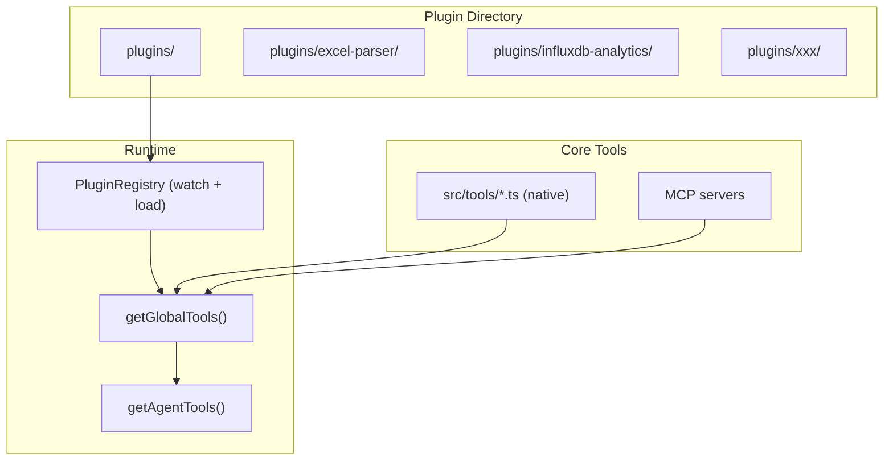

# Plugin 热加载架构设计

**日期：** 2026-04-10
**状态：** 已实施

---

## 现状分析

当前 Samata 的工具注册是**硬编码数组**模式：

```typescript
// src/tools/index.ts — 16 个模块手动 import + 手动加入 modules 数组
const modules: ToolModule[] = [
  clientTools, knowledgeTools, tradeTools, ...
];
```

新增一个工具需要：(1) 写 `src/tools/xxx-tools.ts` (2) 改 `index.ts` import + 加入数组 (3) 重启进程。已有的 `src/plugins/registry.ts` 是早期 CLI 插件概念，接口是 `execute(db, args)` — 与 agent tool 体系（Anthropic tool_use 协议）不兼容，需要重新设计。

## 设计目标

- **约定优于配置**：放进 `plugins/` 目录即生效，无需改核心代码
- **热加载**：运行时 watch 目录，新增/修改插件自动注册，不重启进程
- **与现有体系融合**：插件产出 `Anthropic.Tool[]` + handler，合并进 `getGlobalTools()`，自动享受 agent 权限过滤
- **Skill 互补**：Skill 教 LLM "何时用、怎么组合"，Plugin 提供底层工具能力

## 核心架构



## Plugin 目录结构约定

每个插件一个目录，入口文件 `index.ts`，可选配置 `plugin.json`：

```
plugins/
  excel-parser/
    plugin.json          # 可选：元数据 + 依赖声明
    index.ts             # 必须：导出 PluginModule
    SKILL.md             # 可选：教 LLM 何时/如何使用这组工具
  influxdb-analytics/
    plugin.json
    index.ts
    SKILL.md
```

### plugin.json（可选）

```json
{
  "name": "excel-parser",
  "description": "解析 Excel/CSV 文件，提取数据和结构信息",
  "version": "1.0.0",
  "dependencies": ["xlsx"]
}
```

不提供时，从目录名推导 name，从 `index.ts` 导出的 `description` 取描述。

### index.ts 导出接口

```typescript
import type { PluginModule } from '../../src/plugins/types.js';

const plugin: PluginModule = {
  name: 'excel-parser',
  description: '解析 Excel/CSV 文件，提取数据和结构信息',
  
  toolDefinitions: [
    {
      name: 'parse_excel',
      description: '解析 Excel 文件，返回 sheet 列表和数据',
      input_schema: {
        type: 'object',
        properties: {
          file_path: { type: 'string', description: '文件路径' },
          sheet: { type: 'string', description: 'Sheet 名称，默认第一个' },
          max_rows: { type: 'number', description: '最大行数，默认 500' },
        },
        required: ['file_path'],
      },
    },
  ],

  async handleTool(name, input) {
    if (name === 'parse_excel') return handleParseExcel(input);
    return null;
  },
};

export default plugin;
```

**关键设计决策**：Plugin 导出的接口与现有 `ToolModule` 完全一致（`toolDefinitions` + `handleTool`），加上 `name`/`description` 元数据。这样插件和原生工具对 LLM 来说完全无差别。

### SKILL.md（可选，借鉴 Claude Code）

```markdown
---
name: Excel 数据分析
description: 解析 Excel/CSV 文件并进行数据分析
tools: [parse_excel]
---

## 何时使用
- 用户上传或提到 Excel/CSV 文件需要分析时
- 需要从表格文件中提取特定数据时

## 使用步骤
1. 用 parse_excel 读取文件结构
2. 根据返回的 sheet 和列信息，选择目标数据
3. 对数据进行分析并格式化输出

## 注意事项
- 大文件请限制 max_rows，避免 context 溢出
- 支持 .xlsx, .xls, .csv 格式
```

放在插件目录内的 `SKILL.md` 会被自动发现，注册为该插件的伴生 Skill（name + description 注入 system prompt catalog）。LLM 通过 `get_skill` 按需加载全文。

## PluginRegistry 实现

核心组件 `src/plugins/registry.ts`，重写现有文件：

### 加载流程

1. **启动时**：扫描 `plugins/` 目录，对每个子目录调用 `loadPlugin()`
2. **watch 模式**：`fs.watch('plugins/')` 监听目录变化，增删改自动触发 reload
3. **`loadPlugin(dir)`**：
   - 使用 `import()` 动态导入 `plugins/<name>/index.ts`（tsx 运行时直接支持 TS）
   - 验证导出符合 `PluginModule` 接口
   - 注册到内部 `Map<string, LoadedPlugin>`
   - 若存在 `SKILL.md`，解析 frontmatter 并注册为 auto-managed skill
4. **`unloadPlugin(name)`**：从 Map 移除，清除 module cache，删除伴生 skill

### 热加载策略

```typescript
async function reloadPlugin(pluginDir: string): Promise<void> {
  const name = path.basename(pluginDir);
  // 清除 Node.js ESM import cache（通过 query string 缓存破坏）
  const entryPath = path.join(pluginDir, 'index.ts');
  const mod = await import(`${entryPath}?t=${Date.now()}`);
  const plugin: PluginModule = mod.default;
  
  // 验证接口
  validatePlugin(plugin);
  
  // 替换注册
  loadedPlugins.set(name, { module: plugin, loadedAt: new Date() });
  
  // 处理伴生 SKILL.md
  const skillPath = path.join(pluginDir, 'SKILL.md');
  if (fs.existsSync(skillPath)) {
    syncPluginSkill(name, skillPath);
  }
  
  log.info(`Plugin [${name}] loaded: ${plugin.toolDefinitions.length} tools`);
}
```

### 与 getGlobalTools() 集成

改动 `src/llm/agent.ts`，将 `getGlobalTools()` 扩展为三路合并：

```typescript
export function getGlobalTools(): Anthropic.Tool[] {
  return [...getAllNativeTools(), ...getPluginTools(), ...getMcpTools()];
}
```

`getPluginTools()` 从 PluginRegistry 收集所有已加载插件的 `toolDefinitions`。

### 与 executeTool() 集成

改动路由逻辑，增加 plugin 分支：

```typescript
export async function executeTool(name: string, input: any, ...): Promise<string> {
  if (name.startsWith('mcp_')) return callMcpTool(name, input);
  
  // 先尝试 plugin tools
  const pluginResult = await executePluginTool(name, input);
  if (pluginResult !== null) return pluginResult;
  
  // 再走 native tools
  return executeNativeTool(name, input, ctx);
}
```

这里不需要前缀命名（如 `plugin_`），因为插件自己声明 tool name，只要不与 native 冲突即可（registry 加载时校验冲突）。

## Skill 保留 SQLite，不迁入 plugins/

### 为什么不统一

Plugin 和 Skill 是两个不同抽象层，混在一起会增加复杂度而无收益：

- **Plugin**（文件系统）= 开发者编写的工具能力，有 TypeScript 代码 + handler，需要 import 执行
- **Skill**（SQLite DB）= 运行时积累的知识文档，纯文本，LLM 通过 `save_skill` / `delete_skill` 自管理

DB skill 的核心价值在于**动态性**：LLM 在对话中随时创建、修改、删除，按 `agent_id` 隔离，受 RBAC 权限控制。这些都是 SQLite CRUD 天然擅长的，用文件系统模拟反而更复杂（目录结构模拟 agent_id、文件操作模拟权限检查、watcher 替代 DB 事务）。

### 两层如何协作

```
Plugin SKILL.md  →  buildSystemPrompt() 合并注入  ←  DB skills
        ↓                                              ↓
  （开发者写的使用指南）                         （LLM 运行时积累的知识）
        ↓                                              ↓
        └──────── 统一的 skill catalog ────────────────┘
                  （name + description 列表）
```

- Plugin 目录内的 `SKILL.md` 在 `buildSystemPrompt()` 时**直接从内存读取**（PluginRegistry 缓存），与 DB skills 合并为同一个 catalog 列表注入 system prompt
- **不写入 DB**：plugin skill 是静态的随插件生命周期，与 DB 中 LLM 动态管理的 skill 性质不同
- LLM 通过 `get_skill` 获取全文时，handler 同时查 DB 和 PluginRegistry，优先 DB（允许用户覆盖 plugin 默认 skill）
- Plugin 卸载 → 其 SKILL.md 自动从内存移除，不留 DB 残留

## Agent 权限集成

插件工具进入 `getGlobalTools()` 后，自动受现有权限体系管控：
- `tools_mode = 'all'` 的 agent 自动获得所有插件工具
- `tools_mode = 'standard'` 的 agent 需要在 `tools_list` 中明确添加插件工具名
- `block_tools` 可以屏蔽特定插件工具
- `plugin.json` 可声明 `suggestedAgents: ['otcclaw']`，但不自动生效（仅作为文档）

## 改动的文件

| 文件 | 改动 |
|------|------|
| `src/plugins/types.ts` | 新建：`PluginModule` 接口定义 |
| `src/plugins/registry.ts` | 重写：PluginRegistry（加载/卸载/watch/查询） |
| `src/llm/agent.ts` | 改：`getGlobalTools()` 加 `getPluginTools()`，`executeTool()` 加 plugin 分支 |
| `src/llm/agents/prompt.ts` | 改：`buildSystemPrompt()` 合并 DB skills + plugin SKILL.md |
| `src/tools/skill-tools.ts` | 改：`list_skills` / `get_skill` / `run_skill` 支持 plugin skills 回退 |
| `src/commands/router.ts` | 改：`/plugin list` 展示已加载插件及工具 |
| `src/index.ts` | 改：启动时调用 `initPlugins()`，关闭时 `stopPluginWatcher()` |
| `plugins/excel-parser/` | 新建：示例插件（`index.ts` + `SKILL.md` + `plugin.json`） |
| `plugins/export-csv/` | 迁移：从 `src/plugins/builtin/export-csv.ts` 迁移为新架构插件 |
| `src/plugins/builtin/export-csv.ts` | 删除 |

## 不做的事情

- **不做沙箱隔离**：插件跑在主进程内，与 native tools 同等信任级别（项目自有代码，非第三方市场）
- **不做版本管理**：`plugin.json` 的 version 仅用于日志/调试，不做兼容性检查
- **不做插件市场/远程安装**：插件通过 git 管理，本地文件系统即真理
- **不引入新的 CLI 命令**：通过 `/plugin list` 查看，工具本身通过 agent tool_use 调用
