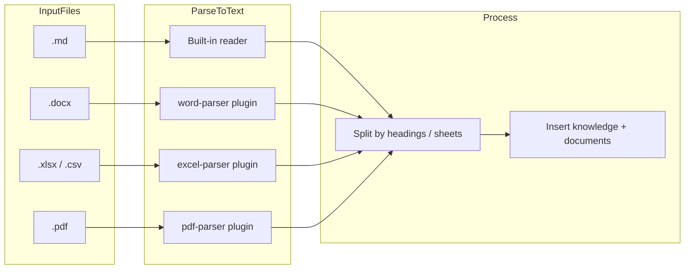

---
docModules:
  - platform
docTopics:
  platform: 文档与知识
canonicalDocs:
  - /platform/agent-capability-model
status: implemented
---

# 文档知识导入与管理

## 概述

为 Agent 增加通用的文档知识导入能力，支持将 `markdown`、`docx`、`xlsx/csv`、`pdf` 文件解析后导入知识库，并按文档维度进行列表、删除和重新导入管理。

## 现状

- 知识库采用 Q&A 模型，存储在 `knowledge` 表中，通过 `knowledge_agents` 关联到 Agent
- 搜索依赖 SQLite `LIKE` + 简单相关性评分，不是向量检索
- Agent 在对话中通过 `search_knowledge` 按需检索知识
- 现有插件已支持 `word-parser`（`.docx`）和 `excel-parser`（`.xlsx/.csv`）
- 之前没有文档注册表，也没有 `pdf` 解析器

## 设计思路

核心方案是把文档拆分为多条知识条目，而不是把整篇文档塞进单条 FAQ。这样可以直接复用现有的 `knowledge` / `knowledge_agents` / `search_knowledge` 体系，不引入额外的向量数据库或检索层。



## 数据库变更

### `src/db/schema.ts`

新增 `documents` 表，用于跟踪文档级元数据：

```sql
CREATE TABLE IF NOT EXISTS documents (
  id          TEXT PRIMARY KEY,
  title       TEXT NOT NULL,
  source_path TEXT NOT NULL,
  file_type   TEXT NOT NULL,
  chunk_count INTEGER NOT NULL DEFAULT 0,
  agent_id    TEXT REFERENCES agents(id),
  created_by  TEXT NOT NULL REFERENCES users(id),
  created_at  TEXT NOT NULL DEFAULT (datetime('now'))
);
```

同时为 `knowledge` 表新增 `document_id` 列：

```sql
ALTER TABLE knowledge ADD COLUMN document_id TEXT REFERENCES documents(id) ON DELETE CASCADE;
```

这样可以支持：

- 按文档批量删除关联知识
- 保留知识来源追踪
- 支持后续 reimport 流程

## 核心导入逻辑

### `src/commands/document-import.ts`

新增的核心函数：

- `importDocument(filePath, agentId, options?)`
- `deleteDocument(docIdPrefix, agentId?)`
- `listDocuments(agentId?)`
- `reimportDocument(docIdPrefix, agentId)`

同时提供 CLI 包装函数：

- `cliImport`
- `cliList`
- `cliDelete`

### 文档拆分策略

#### Markdown / Docx

- Markdown 直接读取
- Docx 通过 `word-parser` 转成 markdown
- 按 `## ` 标题拆分，每个章节作为一条知识
- `question = "{文档标题} - {章节标题}"`
- `answer = 章节正文`
- `tags = 文档标题`
- 若没有 `##`，则整篇作为单条知识
- 若存在 `# 一级标题`，优先用该标题作为文档标题前缀

以 `2603期权总结.md` 为例，实际会拆出：

- `三月香港自主对冲账簿总结 - 概述`
- `三月香港自主对冲账簿总结 - 账簿盈亏分析`
- `三月香港自主对冲账簿总结 - 新增交易情况`
- `三月香港自主对冲账簿总结 - 起息数据统计`
- `三月香港自主对冲账簿总结 - 仓位管理`
- `三月香港自主对冲账簿总结 - 系统开发进展`
- `三月香港自主对冲账簿总结 - 四月计划`

#### Excel / CSV

- 使用 `xlsx` 直接读取 workbook
- 每个 sheet 拆成一条知识
- `question = "{文件名} - {sheet名}"`
- `answer = Markdown table`
- 为避免过大，单个 sheet 默认只保留前 200 行，并附带截断提示

#### PDF

- 新增 `pdf-parser` 插件，使用 `pdf-parse`
- 先提取文本，再复用 markdown 同样的标题拆分逻辑

## Agent Tools

### `src/tools/document-tools.ts`

新增 3 个 native tools：

| Tool | 作用 | 权限 |
|------|------|------|
| `import_document` | 导入文件为知识 | Agent admin |
| `list_documents` | 列出当前 Agent 已导入文档 | 所有用户 |
| `delete_document` | 删除文档及关联知识 | Agent admin |

这些工具已注册到 `src/tools/index.ts`，并加入 `COMMON_SET`，因此 `standard` 模式 Agent 可直接使用。

另外，为了与现有权限模型一致，还补了一条 migration，把 `import_document` / `delete_document` 加入非管理员用户的默认 blocklist。

## CLI 命令

### `src/commands/router.ts`

新增命令：

| 命令 | 作用 | 权限 |
|------|------|------|
| `/doc-import <path>` | 导入文档为知识 | `agent_admin` |
| `/doc-list` | 列出已导入文档 | 无 |
| `/doc-del <id>` | 删除文档及关联知识 | `agent_admin` |

## PDF 插件

### `plugins/pdf-parser/`

新增插件结构与现有 parser 插件保持一致：

- `package.json`
- `tsconfig.json`
- `index.ts`

提供工具：

- `parse_pdf(file_path, max_chars?)`

## 不变的部分

- `search_knowledge` 不需要改动，导入后的知识条目会自动参与现有检索
- `knowledge_agents` 的关联模型保持不变
- 现有 `add_knowledge` / `update_knowledge` / `delete_knowledge` 不受影响

## 验证

已完成以下验证：

- `npx tsc --noEmit` 通过
- `ReadLints` 无新增问题
- 对实际文件 `/tmp/samata/2603期权总结.md` 做了导入测试：
  - 成功导入为 7 条知识
  - `listDocuments()` 能列出文档
  - 重复导入会被拦截
  - 删除文档会级联删除关联知识

## 状态

已完成实现（2026-04-14）。
