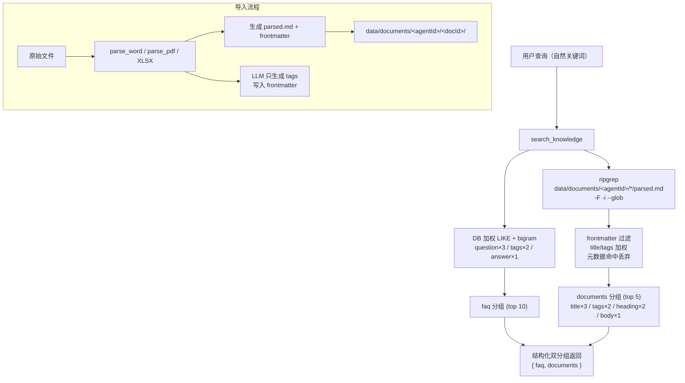

# 评审：文档知识 DB → Markdown + Grep 方案

> 日期：2026-04-20
> 对象：[`2026-04-20_documents-markdown-grep.md`](./2026-04-20_documents-markdown-grep.md)
> 对照：[`2026-04-20_agent-skills-tools-knowledge-memory-overview.md`](./2026-04-20_agent-skills-tools-knowledge-memory-overview.md)
> 类型：建设性评审，不改源码

## 1. 总体判断

方向正确：文档是**长文本 + 导入后只读**，脱离 DB chunk 表符合综述 4.6 对两类来源的区分；保留手动 FAQ 在 DB 也尊重了 FAQ 的 CRUD 属性。

但计划在两处**偏离综述已确立的架构约定**，若不显式回应会产生回归；另有若干实现细节风险需要在动工前统一。已与用户确认两项关键决策：

- **文档放弃多 Agent 共享**，目录固定为 `data/documents/<agent_id>/<docId[:8]>/`。
- **`search_knowledge` 返回结构化双分组** `{ faq: [...], documents: [...] }`，不做分数混排。

本评审据此展开。

## 2. 与综述必须对齐的修正

### 2.1 grep 评分权重需与 FAQ 同构（tags > heading > body）

**偏差**：原计划 §4.2 只分"heading 2x / body 1x"两级，丢掉了综述 4.3 已有的三层语义加权。

**参照** [src/commands/knowledge.ts](src/commands/knowledge.ts) 第 97-103 行：

```97:103:src/commands/knowledge.ts
  // 评分权重：正常词 question+3 tags+2 answer+1，大类词降权 1/1/0，bigram 衍生词 1/1/0
  type TermWeight = { q: number; t: number; a: number };
  const weights: TermWeight[] = allTerms.map((kw, i) => {
    if (i >= primary.length) return { q: 1, t: 1, a: 0 };           // derived bigram
    if (BROAD_BUSINESS_TERMS.has(kw)) return { q: 1, t: 1, a: 0 };  // broad term
    return { q: 3, t: 2, a: 1 };                                     // normal
  });
```

**建议的 grep 权重映射**（保持同构）：

| 命中位置 | 对应 FAQ 字段 | 权重 |
|----------|---------------|------|
| frontmatter `tags` / `title` | tags / question | 3（title）/ 2（tags） |
| markdown heading 行（`#/##/###`） | question | 2 |
| body 行 | answer | 1 |
| frontmatter `document_id` / `created_at` / `created_by` | 无 | **丢弃**（见 §3.2） |

并复刻 `BROAD_BUSINESS_TERMS` 降权规则——大类词（"雪球""场外期权"）在文档里同样泛滥，需要降权。

### 2.2 `search_knowledge` 采用"双查单入口 + 结构化双分组"

**偏差**：原计划 §4.4 让 tool description 指导 LLM"FAQ 用短词、文档用长串"，把查询策略外推给模型。

**建议**：一次调用内部同时跑 DB 加权 LIKE 与 ripgrep，返回结构化两组，不做分数归一化、不做混排：

```json
{
  "faq": [ { "id", "question", "answer", "tags", "relevance" } ],
  "documents": [ { "document_id", "title", "tags", "matches": [ { "line", "snippet", "weight" } ], "relevance" } ]
}
```

- FAQ top 10、documents top 5（两者分数量纲不同，硬混排会把 FAQ 精心设计的加权拍平）。
- tool description 只需说"同时搜 FAQ 与文档，返回两类结果，建议用自然关键词"，不再要求 LLM 决策。

参照 [src/tools/knowledge-tools.ts](src/tools/knowledge-tools.ts) 现有描述风格改写即可。

### 2.3 `collectTagCandidates` 需改用 FS 扫描

**偏差**：[src/commands/document-import.ts](src/commands/document-import.ts) 第 89-110 行 `collectTagCandidates` 通过扫描 DB `knowledge.tags` 组装 LLM chunking 候选：

```89:110:src/commands/document-import.ts
function collectTagCandidates(agentId: string): string[] {
  const db = getDb();
  const rows = db.prepare(
    `SELECT DISTINCT k.tags FROM knowledge k
     WHERE k.tags IS NOT NULL AND k.tags != ''
       AND k.id IN (SELECT knowledge_id FROM knowledge_agents WHERE agent_id = ?)`,
  ).all(agentId) as { tags: string }[];

  const tagSet = new Set<string>();
  for (const row of rows) {
    for (const t of row.tags.split(',')) {
      const trimmed = t.trim();
      if (trimmed) tagSet.add(trimmed);
    }
  }

  for (const t of loadKnowledgeTagsFromConfig(agentId)) {
    tagSet.add(t);
  }

  return [...tagSet];
}
```

迁移后，`document_id IS NOT NULL` 的 knowledge 行将被删除，DB 分支仅剩手动 FAQ 的 tags。

**建议**：改名 `collectTagCandidatesFromFs(agentId)`，来源三合一：

1. 扫描 `data/documents/<agentId>/*/parsed.md` 的 frontmatter `tags` 字段。
2. 扫描手动 FAQ（`knowledge.tags` where `document_id IS NULL`）继续保留——这是 FAQ 自然语料。
3. `loadKnowledgeTagsFromConfig(agentId)` 保留。

## 3. 实现细节风险

### 3.1 ripgrep 调用规范

**风险**：原计划 §4.2 `rg --json -C 3 <keywords> data/documents/<agent_id>/*/parsed.md` 写法隐含 shell 拼接，keywords 含正则元字符会误中或引入注入。

**建议规范**（在 `src/utils/grep-search.ts` 中统一收拢）：

- 用 `execFileSync('rg', args, { encoding: 'utf-8' })`，args 是字符串数组，永不拼 shell。
- 默认 `-F` fixed-string，把 LLM 的自然关键词当字面量，避免正则歧义。
- 多关键词用 `-e kw1 -e kw2 ...`（ripgrep OR 支持），不走 `|` 正则。
- `--glob '**/parsed.md'` 代替 shell 通配，避免 `parsed.json` 误中。
- `-i` 加上，英文 case-insensitive；CJK 天然无大小写。
- `--json` 输出逐行 JSON，按 `{type:"match", data:{path, line_number, lines}}` 提取。
- rg 不存在时的 fallback：用 Node `fs.readFileSync` + `String.includes` 逐文件扫描（23 篇规模下完全可接受）。

### 3.2 Frontmatter 污染过滤

**风险**：ripgrep 不会区分 frontmatter 与正文。例如搜"2026"会把所有文档 frontmatter 的 `created_at: 2026-...` 全部召回。

**建议**：grep-search 侧做后处理：

1. 读取 match 所在文件，定位首个 `---` / `---` 围栏区间（若有）。
2. 若 match line 落在围栏内：
   - 属于 `title` / `tags` 字段 → 按 §2.1 的高权计分。
   - 属于 `document_id` / `created_at` / `created_by` / `file_type` / `agent_id` → **丢弃**。
3. 若在围栏外，按 heading/body 分级计分。

顺便：frontmatter 解析提取 `document_id`、`title`、`tags`、`agent_id` 作为每条结果的元数据（不依赖再查 DB）。

### 3.3 Migration 原子性

**风险**：原计划 Step 5 对每个文档做"移动目录 → 写 frontmatter → 删 DB 行"。用 `runOnce` 包整段，中途任一文件失败会留"部分迁移、但 runOnce 已标 done"的坏状态。

**建议**：

1. **每文件幂等**：进入循环前检查 `data/documents/<agentId>/<docId[:8]>/parsed.md` 是否已存在且首行是 `---`，若是则跳过该文件。
2. **备份先行**：migration 开头执行 `data/backup/<timestamp>.db` 全量拷贝。
3. **FS 先 DB 后**：先完成所有文件的搬移 + frontmatter 注入，**全部成功后**才在单个 SQLite 事务中执行：
   - `DELETE FROM knowledge WHERE document_id IS NOT NULL`（CASCADE 清理 `knowledge_agents`）
   - `UPDATE documents SET stored_path = ?` 批量更新新路径。
4. **失败回滚**：循环内任一文件 throw 则不提交事务、不调用 `runOnce` 的 done 回调（可以借助 `runOnce` 传入的 fn return；看 [src/db/schema.ts](src/db/schema.ts) 具体签名而定）。

### 3.4 Excel / CSV 统一走 parsed.md

**现状**：[src/commands/document-import.ts](src/commands/document-import.ts) 第 132-134 行对 xlsx/csv 写 `parsed.json`：

```132:138:src/commands/document-import.ts
  if (fileType === 'xlsx' || fileType === 'csv') {
    const sheetsData = chunks.map(c => ({ heading: c.heading, content: c.content }));
    fs.writeFileSync(path.join(dir, 'parsed.json'), JSON.stringify(sheetsData, null, 2), 'utf-8');
  } else {
    const fullMd = chunks.map(c => `## ${c.heading}\n\n${c.content}`).join('\n\n');
    fs.writeFileSync(path.join(dir, 'parsed.md'), fullMd, 'utf-8');
  }
```

原计划 §9 把"搜 json 还是转 md"作为悬念。鉴于 `splitExcelBySheets` 本身已经生成了 markdown 表格字符串（[src/commands/document-import.ts](src/commands/document-import.ts) 第 216-249 行），转成统一的 parsed.md 零成本。

**建议**：

- Excel/CSV 也写 `parsed.md`，每个 Sheet 一个 `## {docTitle} - {sheetName}` 段。
- `parsed.json` 保留作为结构化备份（某些未来场景如按行查询可用），但**不参与 grep**（由 `--glob '**/parsed.md'` 天然排除）。
- migration 需同步把存量 xlsx/csv 文档的 parsed.json 转写为 parsed.md（读取 JSON → 重建 markdown 表格）。

### 3.5 `documents.chunk_count` 退役

**现状**：[src/commands/document-import.ts](src/commands/document-import.ts) 第 37、609 行与 CLI 显示都依赖 `chunk_count`：

```769:771:src/commands/document-import.ts
  for (const doc of docs) {
    log.print(`  [${doc.id.slice(0, 8)}] ${doc.title}  (${doc.file_type}, ${doc.chunk_count} 条)  ${doc.created_at}`);
  }
```

**建议**（同 migration 内完成）：

- `ALTER TABLE documents ADD COLUMN size_bytes INTEGER`。
- 迁移时填充 `size_bytes = fs.statSync(parsed.md).size`；新导入流程同步写入。
- `cliList` 改显示 `size_bytes`（KB 化）；`chunk_count` 保留为历史字段，写 0 或保持旧值不再维护。
- `DocumentInfo` 接口同步加 `size_bytes`。

## 4. 修正后的数据流



## 5. 落地 diff 摘要（不写代码，仅列出签名变化）

| 函数 / 文件 | 现签名 / 行为 | 目标签名 / 行为 |
|------|---------|----------|
| `getDocStorageDir` | `(docId) => string` | `(docId, agentId) => string`，路径含 agent_id |
| `persistDocumentFiles` | 按 chunks 拼接写 parsed.md/parsed.json | 写完整 markdown + frontmatter；xlsx/csv 也写 parsed.md |
| `loadAndChunk` | 返回 `{ chunks: Chunk[] }` | 返回 `{ markdown: string, tags: string[] }`（取消 Chunk[]） |
| `tryLLMChunking` / `chunkWithLLM` | 生成分段 + tags | 改为仅生成 tags（prompt 与返回结构同步简化） |
| `fetchKnowledge` | `(kw, agentId) => KnowledgeItem[]` | `(kw, agentId) => { faq, documents }`（分组结果） |
| `collectTagCandidates` | 扫 DB knowledge.tags | 改名 `collectTagCandidatesFromFs`，扫 parsed.md frontmatter + 保留 config + 保留手动 FAQ tags |
| 新：`src/utils/grep-search.ts` | — | 封装 rg 子进程 + frontmatter 解析 + 加权评分 |
| `src/tools/knowledge-tools.ts` | handler 单路结果 | handler 适配 `{ faq, documents }`；description 简化为"自动双查" |
| `src/tools/document-tools.ts` | 显示 chunk_count | 显示 size_bytes |
| `src/db/schema.ts` | — | 新增 `runOnce('migrate-doc-knowledge-to-files-v2', ...)`：备份 DB → FS 搬移 + frontmatter 注入 + xlsx 转 md → 单事务删 knowledge 行 + 更新 stored_path + 加 size_bytes 列 |

migration key 用 **v2** 明示：即使仓库里曾存在同名 `migrate-doc-knowledge-to-files`（例如早期尝试），不会撞车。

## 6. 可选优化（非本次必须）

- **Frontmatter 启动缓存**：当文档数 > 500 时，进程启动读一次所有 parsed.md 的 frontmatter 存内存表 `{ docId → {title, tags, agentId, path} }`，grep 结果增强时零 IO。
- **`/doc-show <id>`**：输出 `stored_path`，方便用户直接 vim 编辑 parsed.md 并重入搜索（文件即真相）。
- **最小集成测试**：导入一份样本 docx → 验证 `knowledge` 表中无 `document_id IS NOT NULL` 行、parsed.md 带 frontmatter、`search_knowledge` 返回 `documents` 分组命中预期关键词、删除文档后目录与 `documents` 行同步消失。

## 7. 与综述章节对齐自检

| 综述章节 | 影响 | 本方案处理 |
|----------|------|-----------|
| §1 Memory | 无 | 不变 |
| §2 Tools（三层过滤、COMMON_SET） | 无 | `search_knowledge` 名称不变，仍在 COMMON_SET 中 |
| §2.6 新增 Tool Checklist | 无 | 本次不新增 tool；不需改 `tools_list`/`user_tools_list` |
| §3 Skills | 无 | 不变 |
| §4.3 Knowledge 多对多 | 部分 | 手动 FAQ 保留多对多；**文档放弃共享**（已确认） |
| §4.6 documents 表 | 小改 | 保留；新增 `size_bytes`；`chunk_count` 留作历史字段 |
| §4.6 导入流程图 | 重写 | 去掉"Chunk → INSERT knowledge"步；parsed.md 注入 frontmatter |
| 权限层级（系统/Agent/普通） | 无 | `import_document` 仍是 Agent admin；grep 走当前 agent 目录即可 |

## 8. 不在本评审范围

- 不改源码、不跑 migration、不调用 rg、不改 DB。
- 未覆盖：多租户大规模下的 grep 性能压测、frontmatter 缓存实现细节、parsed.md 人工编辑的审计机制——留作实施阶段按需补充。
