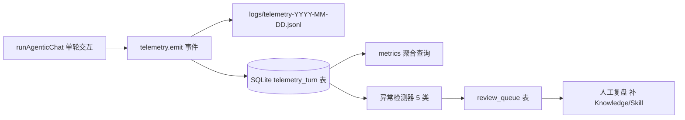

# 关闭 Slide 4 "观测与调优" 宣传与实现的差距

> 起因：[docs/otcclaw-intro.html](../otcclaw-intro.html) 最后一页（Slide 4 · 调优说明）对外宣称了全链路埋点、KPI、5 类异常告警、改进闭环。核实后发现大部分未实现。本计划补齐差距，让材料与代码一致。

## 背景与现状核对

Slide 4（[docs/otcclaw-intro.html](../otcclaw-intro.html) 1237-1394 行）宣称的五类能力，当前实现情况：

| 能力 | 状态 | 证据 |
|---|---|---|
| 耗时拆解（ctx / llm1 / tool / llm2 / render） | 部分做到 | 只有 tool 段有埋点（[src/llm/agent.ts](../../src/llm/agent.ts) 404-418 行），其余四段未打点；飞书有整次 elapsedMs 但非分段 |
| 采集字段（session / user / agent / channel + LLM token + 工具成败） | 部分做到 | channel/user 走 AsyncLocalStorage；LLM token/stop_reason、工具 success/bytes 均未落盘；无统一事件模型 |
| KPI（P50/P95、命中率、Loop 轮次） | 部分做到 | 仅 [scripts/analyze-log.ts](../../scripts/analyze-log.ts) 离线算 P50/P90（不是 P95）；命中率、Loop 轮次无字段；材料上 "78% / 1.6 轮 / 2.4 次" 是编的示例 |
| 异常告警（5 类） | 基本未做到 | 仅一行 `log.warn` 在 Loop 打满（[src/llm/agent.ts](../../src/llm/agent.ts) 55/377 行），其余 4 类均未实现 |
| 改进闭环 | 基本未做到 | 最近的 `wrong_questions` 表是人工错题本，不是全链路闭环；无 telemetry/trace/metrics 表 |

## 总体设计

三条原则：

1. **单一事件模型**：一次 agentic 交互 = 一条 `TelemetryTurn` 记录（含工具调用、LLM 调用子数组）
2. **双写**：JSONL 保留明细与离线分析；SQLite 供 KPI 查询与异常检测
3. **插桩一处，全渠道受益**：在 `runAgenticChat` 内埋点，CLI / 飞书 / 企微 / Telegram 无需各自实现

## 阶段 1（MVP）：分段埋点 + 统一事件

目标：把宣传里"已经在采集"的字段真的采集起来，能产出真实数据的 P50/P95 / 平均工具数 / Loop 轮次。

### 新增文件

- `src/telemetry/types.ts` — 定义 `TelemetryTurn`：
  - `turn_id / session_id / user_id / agent_id / channel / started_at / ended_at`
  - 分段耗时：`ctx_ms / llm_total_ms / tool_total_ms / render_ms`
  - Loop 统计：`loop_rounds / total_tool_calls / stop_reason`
  - LLM 汇总：`model / input_tokens / output_tokens`（每轮求和）
  - 工具子数组：`tools: [{name, round, duration_ms, success, bytes, error?}]`
  - 知识检索：`knowledge_hits[]`（每次 search_knowledge 的命中数）
- `src/telemetry/emitter.ts` — `startTurn() / recordLLM() / recordTool() / recordKnowledge() / endTurn()`，双写 JSONL + SQLite

### 改动点

- [src/db/schema.ts](../../src/db/schema.ts) 用 `runOnce` migration 加 `telemetry_turn` 表
- [src/llm/agent.ts](../../src/llm/agent.ts) `runAgenticChat` 入口 `startTurn()`，`callLLM` 前后夹 `recordLLM()`（读 response 的 usage），工具段接入 `recordTool()`，出口 `endTurn()`
- [src/llm/provider.ts](../../src/llm/provider.ts) `CreateMessageResult` 补 `usage?: { input_tokens, output_tokens }` 可选字段（`stop_reason` 已存在，无需补），从各 provider SDK response 带出
- [src/tools/knowledge-tools.ts](../../src/tools/knowledge-tools.ts) `search_knowledge` 返回前调 `recordKnowledge(hits)`
  - **注意**：`search_knowledge` 也在 `src/commands/knowledge.ts` 的 `searchKnowledge()` 被多个 tool handler 调用；建议直接在 `searchKnowledge()` 函数内部加 hook，或在 emitter 层统一收口，避免只埋一个调用点而漏数据

### 验收

跑 10 轮真实对话后，`SELECT AVG(loop_rounds), AVG(total_tool_calls) FROM telemetry_turn` 能查出真实值，Slide 4 那几个"示例数字"可以替换成数据库里的真实值。

## 阶段 2：P50/P95 + 5 类异常检测

### 新增

- `src/telemetry/metrics.ts` — `getLatencyPercentiles(range)` 返回 P50/P95/P99；SQLite 无原生 percentile，用 `ORDER BY + OFFSET` 即可
- `src/telemetry/detectors.ts` — 5 个纯函数检测器：
  - `detectLoopMaxedOut`：`stop_reason === 'max_iterations'`
  - `detectLoopUnresolved`：`loop_rounds >= 3 && /未找到|暂无数据|无法确认/.test(final_answer)`
  - `detectKnowledgeMiss`：`knowledge_hits` 任一 `hits === 0`
  - `detectToolRetryFail`：同 round 同 tool 失败 ≥ 2
  - `detectLongTail`：`duration_ms > P95_baseline`（baseline 从近 7 天算）
- `src/telemetry/alerts.ts` — `endTurn()` 后串检测器，命中则 `log.warn` + 插入 `review_queue`

### 改动点

- [src/db/schema.ts](../../src/db/schema.ts) 新增 `review_queue` 表（`turn_id / scene / severity / status / created_at`）
- 把 [scripts/analyze-log.ts](../../scripts/analyze-log.ts) 第 594-599 行的 P90 升级为 P95（或两者并存）

### 验收

注入一个 `max_iterations` 场景跑通，`review_queue` 能看到记录；P95 能从 SQL 查出。

## 阶段 3：改进闭环

- CLI 命令 `/review`：列出 `review_queue` 待处理项，查看某条的完整 turn 详情（工具链 + 参数 + 返回）
- 人工处理完标记 `status='resolved'`，可选绑定 `resolved_by_knowledge_id` / `resolved_by_skill_id`，形成可追踪的"补录 → 回归"链路
- **不做**自动补 Knowledge / Skill，坚持人工把关

## 风险与取舍

- **性能**：同步写 JSONL + 异步写 SQLite（`setImmediate`），单轮开销 < 5 ms，不阻塞响应
  - **注意**：`setImmediate` 不保证进程退出前执行完。建议改用 `process.nextTick` + 在进程 `exit` 事件中做 flush，或直接用 better-sqlite3 同步写入（SQLite WAL 模式下写入开销极低，通常 < 1ms）
- **JSONL 文件管理**：日志文件按日期分片（`telemetry-YYYY-MM-DD.jsonl`），需加保留天数上限（如 30 天）的清理逻辑，避免日积月累磁盘膨胀
- **兼容**：`telemetry_turn` 是新表；`CreateMessageResult.usage` 是可选字段，老 provider 不填也不报错
- **范围**：不做分布式 tracing、不引 OpenTelemetry / Prometheus、不做实时 dashboard；需要可视化就往 `analyze-log.ts` 里加
- **文案对齐**：即使只做阶段 1，也应同步把 Slide 4 里"P95 / 命中率 / Loop 轮次"的示例数字加占位符或样本数注脚，避免对外误导

## Todos

### 阶段 1（MVP）

- [ ] 在 `src/telemetry/types.ts` 定义 `TelemetryTurn` 统一事件模型
- [ ] 在 `src/db/schema.ts` 用 `runOnce` migration 加 `telemetry_turn` 表
- [ ] 实现 `src/telemetry/emitter.ts`：`startTurn / recordLLM / recordTool / recordKnowledge / endTurn` 双写 JSONL + SQLite
- [ ] 改 `src/llm/provider.ts`：把 SDK 返回的 usage（input/output tokens）补到 `CreateMessageResult.usage` 可选字段
- [ ] 在 `src/llm/agent.ts` 的 `runAgenticChat` 加分段埋点：ctx / llm1 / tool / llm2 分段计时
- [ ] 在 `src/tools/knowledge-tools.ts` 的 `search_knowledge` 返回前调 `recordKnowledge(hits)`
- [ ] 跑 10 轮真实对话，用 SQL 验证 P50 / 平均工具数 / Loop 轮次能查出真实数值

### 阶段 2

- [ ] 实现 `src/telemetry/metrics.ts`，SQL 算 P50 / P95 / P99
- [ ] 实现 `src/telemetry/detectors.ts` 的 5 个纯函数检测器
- [ ] 在 `endTurn` 后串检测器，命中则 `log.warn` + 写 `review_queue` 表
- [ ] 在 `src/db/schema.ts` 加 `review_queue` 表
- [ ] 把 `scripts/analyze-log.ts` 的 P90 升级为 P95

### 阶段 3

- [ ] 加 CLI 命令 `/review`：列表 + turn 详情 + 标记 resolved（可选关联 knowledge_id / skill_id）
- [ ] 回头把 `docs/otcclaw-intro.html` Slide 4 里的示例数字换成真实数据或加样本数注脚
