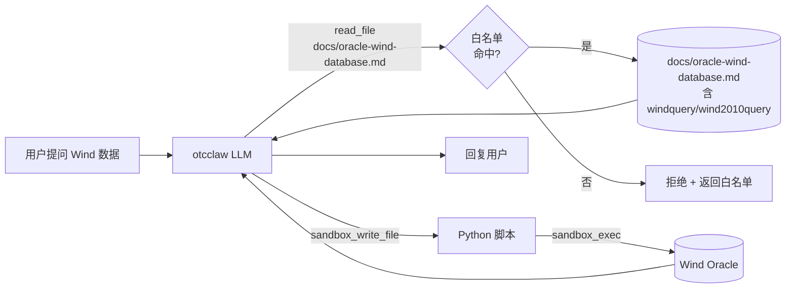

# Agent read_file 白名单

## 背景与根因

otcclaw 的 system prompt 让它"读 `docs/oracle-wind-database.md`"，但：

- otcclaw 的 `tools_list`（`src/db/schema.ts` 中 `seed-otcclaw` 与后续 migrations）**没有 `read_file`**，COMMON_SET（`src/llm/agents/config.ts:14-35`）也不含。
- 仅有的文件读取工具 `sandbox_read_file` 限定在 `/tmp/samata/sandboxes/{agent}/{user}/`，沙箱用 `bwrap` 仅 ro-bind `/usr /lib /bin /etc`（`src/commands/sandbox.ts:154-201`），项目 `docs/` 根本不挂载进沙箱。

结果：LLM 看见指令 → 没法读 → 只能瞎猜 `wind/wind`，全部 ORA-01017。

附带发现：现有 `read_file` handler 完全没有任何权限检查，只是因为不在 COMMON_SET 才"碰巧"普通 agent 调不到。本次顺手把鉴权补齐，避免后续误授权时 `.env` 等敏感文件被 LLM 读出来。

## 设计原则

- **最小改动**：不引入新依赖，不改 sandbox。仅新增 agent 级 `read_file` 白名单。
- **默认拒绝**：白名单文件存在 → 严格匹配；不存在 → 仅 system admin 通过（保持 admin/alter-ego 现状）。
- **精确路径**（不上 glob）：项目暂无 glob 库，路径用 `path.relative(PROJECT_ROOT, abs)` 规范化后做字符串相等比较。后续要扩展再说。
- **凭证不进 system prompt**：windquery / wind2010query 留在 docs 里，需要时由 LLM 主动 `read_file` 取，比 prompt 内嵌更安全且单一来源。

## 鉴权逻辑

```
read_file(path):
  agent = getCurrentAgent()
  abs   = resolve(path)
  rel   = path.relative(PROJECT_ROOT, abs)

  if abs 越出 PROJECT_ROOT: 拒绝

  allowlist = loadAllowlist(agent.name)   # config/agents/<name>.files.json
  if allowlist 存在:
      if rel ∈ allowlist: 允许
      else: 拒绝（错误信息附 allowlist 列表，便于 LLM 改正）
  else:
      if isSystemAdmin(): 允许（admin / alter-ego 保持兼容）
      else: 拒绝
```

## 文件改动

### 1. 新增 `config/agents/otcclaw.files.json`

```json
[
  "docs/oracle-wind-database.md"
]
```

后续按需追加（如 `config/customers.json` 等只读参考）。

### 2. 修改 `src/tools/file-tools.ts`

- 新增 `loadAgentFileAllowlist(agentName: string): string[] | null`：读 `config/agents/<agentName>.files.json`，缓存到内存（带 mtime 失效），文件不存在返回 `null`。
- 改写 `handleReadFile(input)`：
  - 复用既有 `checkProjectPath` 思路把 `path` 规范化为相对项目根的路径，挡住 `..` / 绝对路径越界。
  - 取当前 agent → 走上面"鉴权逻辑"决策树。
  - 拒绝时返回 `{error: "read_file not allowed: <rel>. Allowed: [...]"}`，错误里列出白名单方便 LLM 调整。
- `read_file` 工具描述补充一行："只能读取当前 agent 白名单内的文件；不在白名单的请求会被拒绝并附可读列表。"

### 3. 修改 `src/db/schema.ts`

新增幂等 migration `otcclaw-add-read-file`：把 `read_file` 加进 otcclaw 的 `tools_list`。**不**加进 `user_tools_list`（read 是只读，普通成员可用）。

```ts
runOnce('otcclaw-add-read-file', () => {
  const row = db.prepare("SELECT tools_list FROM agents WHERE name = 'otcclaw'")
    .get() as { tools_list: string | null } | undefined;
  if (!row) return;
  const list: string[] = row.tools_list ? JSON.parse(row.tools_list) : [];
  if (!list.includes('read_file')) {
    list.push('read_file');
    db.prepare("UPDATE agents SET tools_list = ?, updated_at = datetime('now') WHERE name = 'otcclaw'")
      .run(JSON.stringify(list));
  }
});
```

### 4. 修改 `config/agents/otcclaw.md`

把"## 数据查询参考"小节的死指引改成可执行：

- 旧：`若用户需要查询 Wind 金融数据库... 请参考 docs/oracle-wind-database.md`
- 新：`调用 read_file 读取 docs/oracle-wind-database.md（已在你的可读白名单内），文档含 Oracle 凭证、24 张 Wind 表清单、查询模式与 LOB 处理`。

工作流程改为：read_file 读 docs → sandbox_write_file 写 Python 脚本 → sandbox_exec 执行 → 汇总回复。

## 流程对照



## 兼容性与风险

- **admin / alter-ego**：无 `<name>.files.json`，走"system admin 通行"分支，行为不变。
- **其他 standard agent**（doctor / tutor / man / potato / falcon / ticlaw）：默认无白名单，即使误把 `read_file` 加进 `tools_list` 也读不到任何文件——这是收益（之前 read_file 没有任何 agent 级保护）。
- **新增 agent 想用 read_file**：必须同时改 `tools_list` + 创建 `<name>.files.json`，符合"权限矩阵规范"明示授权原则。
- **路径越界 / 软链**：`path.resolve` + `startsWith(PROJECT_ROOT)` 已能挡 `..` 与绝对路径越界。

## 验证步骤

1. 重启 / `/reload_app`，DB 检查：
   ```sql
   SELECT tools_list FROM agents WHERE name='otcclaw';   -- 含 read_file
   ```
2. otcclaw 普通成员对话："Wind 数据库里 ASHAREEODPRICES 的 schema 是什么？"
   - 期望：调 `read_file('docs/oracle-wind-database.md')` 成功 → 写 sandbox 脚本 → 用 windquery / wind2010query 连上 Oracle → 返回结果。
3. 反向测试：让 otcclaw 试 `read_file('.env')` → 期望拒绝并附白名单。
4. admin agent 调 `read_file('.env')` → 期望仍可读（向后兼容）。
