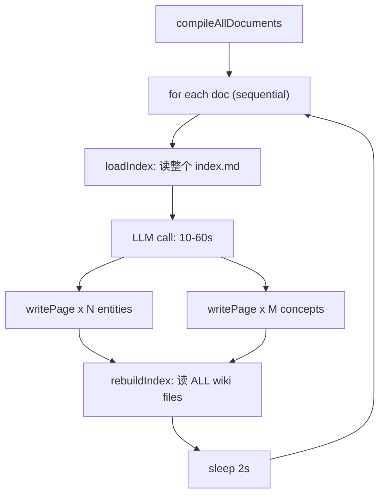

---
docModules:
  - external-data
docTopics:
  external-data: Wiki 与文档源
canonicalDocs:
  - /external-data/wiki-and-doc-sources
status: implemented
---

# Wiki Compile 性能优化

## 概述

分析当前 wiki 编译的性能瓶颈，提出分层优化方案——从快速修复（并行化、去冗余）到架构改进（增量编译、轻量模型），预计可将 200 文档批量编译从 ~2 小时压缩到 ~15 分钟。

## 当前瓶颈分析

逐个文档的编译流程：



**按影响排序的瓶颈：**

| 瓶颈 | 单次耗时 | 200文档总耗时 | 可优化程度 |
|------|----------|-------------|-----------|
| LLM API 调用（串行） | 10-60s | 30-200 min | 并行可 3-5x |
| rebuildIndex 每次读全部 wiki 文件 | 0.5-2s | 2-7 min | 批量化可 ~0 |
| 固定 2s sleep | 2s | 6.7 min | 去掉，改 rate-limit |
| index 越来越大→input token 增长 | 随文档增加 | 后期每次多花 token | 精简 prompt |
| 内容截断 8000 字 | - | 信息丢失 | 需架构改 |

**最关键的问题**：`compileAllDocuments` 是 **纯串行** 的，每个文档排队等上一个的 LLM 响应 + 2s delay。200 个文档 × (平均 20s + 2s) = **73 分钟纯等待**。

## 优化方案（分层）

### Layer 0: 快速修复（改动最小，效果最大）

修改 [`src/services/wiki-compile.ts`](src/services/wiki-compile.ts) 中的 `compileAllDocuments`：

**0a. 并行 LLM 调用**（预计 3-5x 提速）

```typescript
const limit = pLimit(3); // 内联实现，3 路并发，避免 rate-limit

const tasks = docDirs.map(docDir => limit(async () => {
  // ... existing per-doc logic
}));

await Promise.allSettled(tasks);
```

- 3 路并发：200 × 20s / 3 = **~22 min**（vs 原来 73 min）
- 5 路并发：200 × 20s / 5 = **~13 min**
- 可通过 `WIKI_COMPILE_CONCURRENCY` 环境变量配置

**0b. 去掉固定 2s sleep**

原 `await new Promise(r => setTimeout(r, 2000))` 是无条件等待。改为依赖 LLM provider 层的 rate-limit / retry，不在 compile 层 sleep。

**0c. 延迟 rebuildIndex，批量做一次**

当前每编译一个文档就 `rebuildIndex`（读所有 wiki 文件）。改为：
- 批量模式：`compileDocumentToWiki` 传 `skipRebuildIndex: true`
- `compileAllDocuments` 结束后调一次 `rebuildIndex`
- 单文档导入时（`document-import.ts` 触发的异步编译）仍在单次结束后 rebuild

### Layer 1: Prompt 瘦身（减少 token 开销）

当前每次 LLM 调用把完整 `index.md` 塞进 prompt。随着 wiki 增长，index 可能有几千字。

优化：只传 entity/concept **名称列表**，不传完整 index 内容：

```typescript
// Before: 完整 index (含所有摘要行)
const existingIndex = loadIndex(agentId);

// After: 只传名称列表 (~200 bytes vs ~5KB)
const existingNames = collectPageNames(wikiDir);
// => "已有 entities: 金鍀, Jump, 磐松, ...\n已有 concepts: FIX协议, 北上交易, ..."
```

这样 LLM 仍能判断 `action: "create"` vs `"replace"`，但 input token 从几千降到几百。

### Layer 2: 增量编译（Phase 3 Xbase 批量导入时必需）

原逻辑用 "summary 文件是否存在" 做粗粒度跳过，但如果文档内容更新了（reimport），旧 summary 仍在，会被错误跳过。

改进：在 DB 记录 `documents.wiki_compiled_hash`，对比 `content_hash` 决定是否需重新编译。

```sql
-- migration: add-documents-wiki-compiled-hash
ALTER TABLE documents ADD COLUMN wiki_compiled_hash TEXT;
```

编译成功后：`UPDATE documents SET wiki_compiled_hash = content_hash WHERE id = ?`

### Layer 3: 模型分级（长期）

不是所有文档都需要最强模型：

- **短文档 (<2000字)、结构清晰**：用 Gemini Flash / Haiku（2-5s，成本 1/10）
- **长文档、多实体交叉**：用当前 DREAM_MODEL（较强模型）
- 逻辑：按 `docContent.length` 与 `WIKI_FAST_THRESHOLD` 选模型

环境变量（可选，未设则全用 DREAM provider）：

```bash
WIKI_FAST_PROVIDER=gemini
WIKI_FAST_MODEL=gemini-2.0-flash
WIKI_FAST_THRESHOLD=2000
```

## 对已有 Phase 1-4 计划的影响

这些优化是**正交**的，不影响架构 redesign 方向：

- Phase 1（entity 页变聚合索引）：`writePage` 改为 merge 后，每次写入稍慢（多一次读），但 LLM 调用次数不变
- Phase 3（Xbase 200+ 文件导入）：**必须**先实现 Layer 0（并行化），否则批量导入不可用
- Phase 4（wiki-first 搜索）：与编译效率无关

## 推荐实施顺序

1. **Layer 0a + 0b + 0c** — 立即可做，改动 ~30 行，效果最大（3-5x 提速）
2. **Layer 1** — 与 Phase 1 一起做（精简 prompt 同时改 entity 页结构）
3. **Layer 2** — 与 Phase 1.5（文档修正）一起做（`wiki_compiled_hash` 支持增量更新）
4. **Layer 3** — Phase 3 批量导入时按需引入

**预估效果**：Layer 0 完成后，200 文档批量编译从 ~73 分钟降至 ~15 分钟。加上 Layer 1-2 后可进一步降至 ~10 分钟。

## 实施状态

| 层级 | 状态 | 说明 |
|------|------|------|
| Layer 0a | 已完成 | `pLimit` 内联并发，`WIKI_COMPILE_CONCURRENCY` 默认 3 |
| Layer 0b | 已完成 | 移除 2s sleep |
| Layer 0c | 已完成 | 批量模式 `skipRebuildIndex`，结束时一次 `rebuildIndex` |
| Layer 1 | 已完成 | `collectPageNames()` 替代完整 index |
| Layer 2 | 已完成 | `wiki_compiled_hash` migration + 编译后 stamp |
| Layer 3 | 已完成 | `WIKI_FAST_*` 环境变量，短文档可选快速模型 |

**修改文件：**

| 文件 | 变更 |
|------|------|
| `src/services/wiki-compile.ts` | 新建/恢复，含全部 Layer 0-3 |
| `src/db/schema.ts` | `add-documents-wiki-compiled-hash` migration |
| `.env.example` | 补充 `WIKI_COMPILE_CONCURRENCY`、`WIKI_FAST_*` 说明 |
