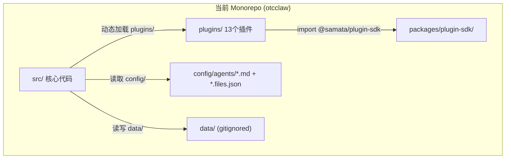
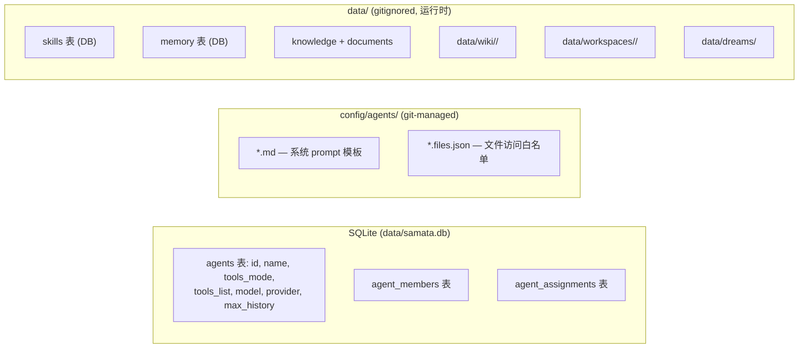

# Samata 双 Repo 拆分 + Agent 配置/数据管理方案

## 当前架构概览



**问题：** 核心平台、插件市场、agent 配置、运行时数据全部混在一个 repo，无法独立演进。

---

## 目标拆分结构

### Repo 1: `samata`（核心平台）

```
samata/
├── src/                         # 核心代码（CLI, server, bots, LLM, DB）
├── packages/
│   └── plugin-sdk/              # SDK（同时发布到 npm）
├── config/
│   └── agents/                  # 内置 agent 默认配置（seed prompts）
│       ├── _default.md
│       └── *.files.json
├── data/                        # 运行时数据（gitignored）
├── docs/, tests/, scripts/
└── package.json
```

### Repo 2: `samata-plugins`（插件市场）

```
samata-plugins/
├── csv-export/                  # 每个 plugin 一个顶层目录
├── diagram/
├── excel-parser/
├── pdf-parser/
├── word-parser/
├── client-manager/
├── trade-query/
├── pricing/
├── hedge-ratio/
├── wework-qa/
├── health-tracker/
├── wrong-questions/
├── wiki-sync/
├── package.json                 # workspace root（依赖 @samata/plugin-sdk）
└── tsconfig.json
```

---

## 关键设计决策

### 1. Plugin 加载方式：可配置目录

Samata 通过 `SAMATA_PLUGINS_DIR` 环境变量指定 plugins 目录（默认 `./plugins/`）：

```
# .env
SAMATA_PLUGINS_DIR=../samata-plugins   # 指向 plugins repo clone 路径
```

`src/plugins/registry.ts` 改为从该环境变量读取：

```ts
const PLUGINS_DIR = path.resolve(
  process.env.SAMATA_PLUGINS_DIR || path.join(PROJECT_ROOT, 'plugins')
);
```

**部署方式灵活：**
- 开发时：两个 repo 并排 clone，env 指向 `../samata-plugins`
- 生产时：plugins repo clone 到固定路径，或 symlink 到 `plugins/`
- 极简部署：不配置 env，samata 内置空 `plugins/`，按需手动复制想要的 plugin

### 2. `@samata/plugin-sdk` 发布策略

- 保留在 samata repo 的 `packages/plugin-sdk/` 中作为源码
- 发布到 npm（`@samata/plugin-sdk`），plugins repo 作为普通 npm 依赖引用
- 版本语义化管理：SDK 接口变更时 bump major version
- plugins repo 的 `package.json` 中 `"@samata/plugin-sdk": "^1.0.0"`

### 3. 解决 Plugin 对 `src/` 的违规依赖

拆分前必须清除所有 plugin 对 `../../src/` 的 dynamic import：

| Plugin | 违规 import | 解法 |
|--------|------------|------|
| wework-qa | `../../src/llm/provider.js` | PluginContext 注入 `callLLM()` 方法 |
| hedge-ratio | `../../src/wework/bot.js` | PluginContext 注入 `sendMessage()` 回调 |
| trade-query | 读 `config/customers.json` | init() 时传入 configDir 或复制到 plugin 自己的 config/ |

扩展 PluginContext（最小集）：

```ts
interface PluginContext {
  // ...已有...
  callLLM?(messages: Array<{role: string; content: string}>, options?: {model?: string}): Promise<string>;
  sendNotification?(channel: string, targetId: string, message: string): Promise<void>;
  getConfigDir?(): string;
}
```

---

## Agent 配置管理建议

当前 agent 配置分散在三处，建议的管理策略：



### 层次划分

| 层 | 内容 | 存储位置 | 生命周期 |
|----|------|----------|----------|
| **平台层** | 核心代码、COMMON_SET tools、plugin-sdk | samata repo | 随版本发布 |
| **Agent 定义** | name, tools_mode, tools_list, model, members | DB `agents` 表 | seed 初始化 + 运行时可改 |
| **Agent 人设** | system prompt 模板 | `config/agents/<name>.md` | git 管理，随部署 |
| **Agent 安全** | read_file 白名单 | `config/agents/<name>.files.json` | git 管理 |
| **Agent 知识** | knowledge、documents、wiki、skills、memory | DB + `data/` 文件系统 | 运行时积累，需备份 |
| **会话状态** | workspaces、dreams | `data/` | 运行时，可丢弃 |
| **Plugin 数据** | 各 plugin 独立 SQLite | `data/plugins/<name>/` | 运行时，需备份 |

### 建议改进

**a) Agent 人设（prompt）管理**

当前状态：`.md` 文件 git 管理但新文件被 `.gitignore` 排除，矛盾。

建议：
- 内置 agent 的 `.md` 留在 samata repo 作为默认模板
- **运行时允许通过 admin CLI/API 覆盖**：DB 新增 `agents.custom_prompt` 列（nullable），非空时优先于文件
- 加载优先级：`agents.custom_prompt` > `config/agents/<name>.md` > `config/agents/_default.md`
- 这样无需改代码即可定制 agent 人设，同时保留文件作为 fallback

**b) 数据备份策略**

`data/` 全部 gitignored，但包含关键业务数据：

- **必须备份**：`data/samata.db`（主库）、`data/plugins/*/`（plugin DB）、`data/documents/`（导入文档）
- **可重建**：`data/wiki/`（从知识库重编译）、`data/workspaces/`（会话上下文）、`data/dreams/`（每日重生成）
- 建议添加 `scripts/backup.sh`：定期打包 `data/samata.db` + `data/plugins/` + `data/documents/` 到带时间戳的归档

**c) 多 Agent 并行无冲突**

当前架构已天然支持多 agent 并行：
- 每个 agent 有独立的 tools_list、知识库、wiki、workspace
- 数据按 `agent_id` 隔离（documents、wiki、workspaces 用 agent name 做子目录）
- 同一个 bot app 可通过 `agent_assignments` 绑定不同 agent
- 无需额外改造

---

## 拆分实施路线

### Phase 0: 重命名主库 `yanyu.db` -> `samata.db` ✅

代码引用（~12 处）：

| 文件 | 说明 |
|------|------|
| `src/db/connection.ts` | `DB_PATH` 主定义 |
| `.gitignore` | `data/yanyu.db*` 三行 |
| `plugins/client-manager/index.ts` | 一次性迁移路径 |
| `plugins/pricing/index.ts` | 一次性迁移路径 |
| `src/commands/knowledge-import.ts` | `DB_PATH` 常量 |
| `src/commands/sandbox.ts` | 注释 |
| `scripts/sync-plugin-db.ts` | `MAIN_DB_PATH` |
| `scripts/analyze-log.ts` | 2 处 `dbPath` |
| `scripts/update_qa.mjs` | 直接引用 |
| docs/ (3 个文件) | 文档引用 |

运行时迁移：`connection.ts` 增加 `migrateDbFile()` 自动将 `yanyu.db` rename 为 `samata.db`（含 `-shm`/`-wal`）。

### Phase 1: 解除 Plugin 违规依赖（在拆分前）✅

- wework-qa：3 处 `../../src/` import 替换为 `ctx.callLLM` + `ctx.sendNotification`
- hedge-ratio：`../../src/wework/bot.js` 替换为 `ctx.sendNotification('wework', ...)`
- trade-query：`getDataDir()` hack 替换为 `ctx.getConfigDir()`
- 验证所有 13 个 plugin 仅依赖 `@samata/plugin-sdk` 类型 + `PluginContext` 运行时注入

### Phase 2: `@samata/plugin-sdk` 发布 ✅

- `packages/plugin-sdk/` 移除 `private:true`，添加 `exports`/`dist`/`publishConfig`
- 新增 `tsconfig.build.json` 生成 `.js` + `.d.ts`
- 首版发布 `@samata/plugin-sdk@1.0.0`（需手动 `npm publish`）

### Phase 3: Registry 支持可配置目录 ✅

- `src/plugins/registry.ts` 的 `PLUGINS_DIR` 改为读 `SAMATA_PLUGINS_DIR` env
- 兼容默认 `./plugins/`（不配置 env 时行为不变）
- `.env.example` 添加说明

### Phase 4: 创建 `samata-plugins` repo ✅

- 新建 git repo `~/source/samata-plugins`
- 将 `plugins/*` 13 个目录内容移入
- 设置 `package.json` workspace，依赖 `@samata/plugin-sdk@^1.0.0`
- plugins 暂保留在 monorepo（待 SDK 发布后正式切换）

### Phase 5: Agent prompt 可覆盖机制 ✅

- DB `agents` 表新增 `custom_prompt TEXT` 列（migration）
- `loadPromptTemplate()` 优先级：`agent.customPrompt` > `config/agents/<name>.md` > `_default.md`

---

## 风险与注意

- **plugin-sdk 版本兼容**：SDK 接口变更必须保持向后兼容（新增可选字段），breaking change 走 major bump，plugins repo 需同步升级
- **开发体验**：两个 repo 的联调需确保 plugins 修改能热加载（registry 的 `fs.watch` 需指向正确目录）
- **Plugin 配置文件**（如 `wiki-sync/config/config.yaml`、`trade-query` 的 `customers.json`）：跟随 plugins repo，部署时按需配置
- **现有 `.gitignore` 中 `config/agents/*` 规则**：拆分后建议取消此规则，让所有 agent prompt 正常 git 管理
