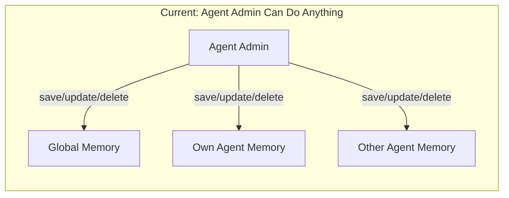
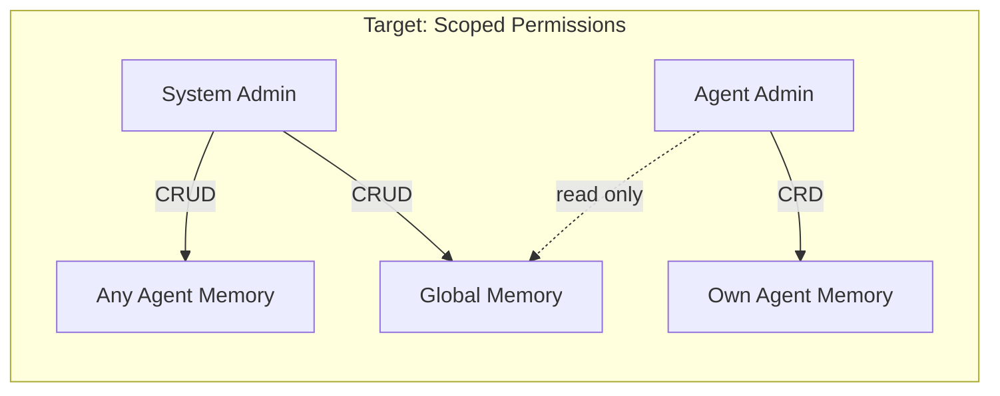

# Memory 权限隔离方案

## 现状分析

当前权限模型：`save_memory` / `update_memory` / `delete_memory` 都只检查 `isAgentAdmin(currentAgentId)`，通过后可操作**任意记忆**（包括其他 agent 的、全局的）。`updateMemory` 和 `deleteMemory` 只按 ID 前缀匹配，不检查目标记忆归属。




## 目标权限模型




规则总结：

- **读取**：不变。所有用户可读取全局 + 当前 agent 记忆（search / list / buildMemoryBlock）
- **保存全局记忆**（`scope='global'`）：仅 system admin（`isSystemAdmin()`）
- **保存 agent 记忆**（`scope='agent'`）：该 agent 的 admin（`isAgentAdmin(agentId)`）
- **修改/删除记忆**：先查出目标记忆行，根据其 `scope` 和 `agent_id` 判断权限：
  - `scope='global'` → 仅 system admin
  - `scope='agent'` → system admin 或该 `agent_id` 的 agent admin

## 改动方案

### 1. 数据层 — [src/llm/agents/memory.ts](src/llm/agents/memory.ts)

`updateMemory` 和 `deleteMemory` 当前只返回 `{success, error}`，不返回行的 scope/agent_id 信息。需要改为先查整行再校验归属：

- `**updateMemory(idPrefix, updates)`** → 查到目标行后，返回行的 `scope` 和 `agent_id`，或者直接在数据层做归属检查。**推荐方案**：数据层保持纯逻辑不做 RBAC，但让函数返回操作前的行信息供上层校验。改为先 SELECT 完整行，把 `scope`/`agent_id` 返回给调用方，或者增加一个 `getMemoryByIdPrefix(idPrefix)` 辅助函数。
- `**deleteMemory(idPrefix)`** → 同上。

具体：新增一个辅助函数 `getMemoryByIdPrefix(idPrefix): MemoryRow | undefined`，从 `updateMemory` 和 `deleteMemory` 内部提取出来复用，也供 tool handler 使用。

### 2. 工具层 — [src/tools/memory-tools.ts](src/tools/memory-tools.ts)

`**handleSaveMemory**`：

```typescript
const scope = input.scope ?? 'global';
if (scope === 'global') {
  if (!isSystemAdmin()) return error('仅系统管理员可保存全局记忆');
} else {
  if (!isAgentAdmin(currentAgentId ?? '')) return error('仅 Agent 管理员可保存 Agent 记忆');
}
```

`**handleUpdateMemory**`：

```typescript
const row = getMemoryByIdPrefix(input.id);
if (!row) return error('未找到');
if (row.scope === 'global') {
  if (!isSystemAdmin()) return error('仅系统管理员可修改全局记忆');
} else {
  if (!isSystemAdmin() && !isAgentAdmin(row.agent_id!)) return error('无权修改该记忆');
}
```

`**handleDeleteMemory**`：同 update 的归属检查逻辑。

`**save_memory` tool definition**：`scope` 字段的描述改为说明权限差异：`'global'（全局，仅系统管理员可用）或 'agent'（仅当前 Agent，需 Agent 管理员权限）。默认 agent`。

> **默认值变更**：当前默认 scope 是 `'global'`。考虑到收紧后大多数 agent admin 无法写全局记忆，建议将默认 scope 改为 `'agent'`，更符合最小权限原则。

### 3. CLI 层 — [src/commands/memory-cmd.ts](src/commands/memory-cmd.ts)

`addMemory` 和 `delMemory` 当前没有权限检查。需要补上：

- `addMemory`：在调用 `saveMemory` 前，按 scope 检查权限（与 tool handler 一致）
- `delMemory`：先用 `getMemoryByIdPrefix` 查行，再按归属检查权限

### 4. 飞书 Bot 层

飞书 bot 的 memory handler 使用 `runAgenticChat` → tool handler，已被 tool 层的权限覆盖。飞书 slash command (`handleMemoryCommand`) 中的 `add` / `del` 已有 `isAdminFeishuUser` 检查，且 `add` 固定写 `scope: 'agent'`，无需改动。

### 5. Tool 描述更新

更新 `save_memory`、`update_memory`、`delete_memory` 的 description，加入权限说明，让模型知道 scope 限制。